<div id="top">

<!-- HEADER STYLE: CLASSIC -->
<div align="center">


# ASZHOROVICEWEBPHP

<em>Secure, Seamless, Powering Your Digital Race Experience</em>

<!-- BADGES -->


<em>Built with the tools and technologies:</em>


</div>
<br>

---

## 📄 Table of Contents

- [Overview](#-overview)
- [Getting Started](#-getting-started)
    - [Prerequisites](#-prerequisites)
    - [Installation](#-installation)
    - [Usage](#-usage)
    - [Testing](#-testing)
- [Features](#-features)
- [Project Structure](#-project-structure)
    - [Project Index](#-project-index)
- [Roadmap](#-roadmap)
- [Contributing](#-contributing)

---

## ✨ Overview

ASZhoroviceWebphp is a versatile PHP web application framework tailored for event management, security, and dynamic content delivery. It simplifies secure environment setup, document generation, and administrative oversight, making it ideal for developers building robust, scalable web solutions. The core features include:

- 🛡️ **Security Environment:** Loads sensitive credentials from a .env file, ensuring secure and environment-specific configurations.
- 📄 **PDF Generation:** Integrates PHP libraries for creating and manipulating PDFs, perfect for reports and invoices.
- 🔐 **User Authentication:** Manages secure login sessions and user workflows with detailed logging.
- ⚙️ **Content Management:** Supports dynamic updates to homepage carousels and event data, enabling flexible content control.
- 📝 **Audit & Security Policies:** Implements comprehensive logging and vulnerability reporting to safeguard the application.
- 💾 **Database Integration:** Handles registration data, logs, and environment configurations with structured schemas.

---

## 📌 Features

|      | Component       | Details                                                                                     |
| :--- | :-------------- | :------------------------------------------------------------------------------------------ |
| ⚙️  | **Architecture**  | <ul><li>PHP-based MVC structure</li><li>Separation of concerns with controllers, views, models</li><li>Uses Composer for dependency management</li></ul> |
| 🔩 | **Code Quality**  | <ul><li>Standard PHP syntax, PSR-12 compliance likely</li><li>Moderate code comments, some inline documentation</li><li>Code organization follows common PHP project conventions</li></ul> |
| 📄 | **Documentation** | <ul><li>Basic README with project overview</li><li>Configuration instructions sparse</li><li>No dedicated API or developer docs</li></ul> |
| 🔌 | **Integrations**  | <ul><li>Uses Composer for PHP dependencies</li><li>NPM for JavaScript packages</li><li>Includes JSON configs for registration, carousel images</li><li>Potential integration with SQL database</li></ul> |
| 🧩 | **Modularity**    | <ul><li>Moderate modularity via separate PHP classes/files</li><li>Uses JSON files for configurable content</li><li>Limited plugin or extension points</li></ul> |
| 🧪 | **Testing**       | <ul><li>No evident automated tests or testing framework</li><li>Likely manual testing required</li></ul> |
| ⚡️  | **Performance**   | <ul><li>Basic caching or optimization not apparent</li><li>Uses minified JS/CSS (implied by presence of JS, bootstrap)</li></ul> |
| 🛡️ | **Security**      | <ul><li>Potential vulnerabilities due to lack of explicit security measures</li><li>Uses robots.txt, but no evident CSRF/XSS protections</li></ul> |
| 📦 | **Dependencies**  | <ul><li>PHP: via composer.json and composer.lock</li><li>JavaScript: via package.json</li><li>JSON configs for registration, images, race dates</li></ul> |

---

## 📁 Project Structure

```sh
└── ASZhoroviceWebphp/
    ├── README.md
    ├── SECURITY.md
    ├── SECURITY_ENV_SETUP.md
    ├── SVGLOGA
    │   ├── JOP.svg
    │   ├── lol.txt
    │   └── sadasdsd.svg
    ├── back
    │   ├── Database
    │   ├── LOGGING_SYSTEM.md
    │   ├── delete_prihlaska.php
    │   ├── login.php
    │   ├── logout.php
    │   ├── register.php
    │   ├── update.php
    │   ├── updateZaplaceno.php
    │   ├── update_carousel.php
    │   ├── update_date.php
    │   └── view_logs.php
    ├── composer.json
    ├── composer.lock
    ├── front
    │   ├── Login.php
    │   ├── Login_backup.php
    │   ├── carousel_images.json
    │   ├── css
    │   ├── download_pdf.php
    │   ├── img
    │   ├── imgs.php
    │   ├── js
    │   ├── main.php
    │   ├── main_backup.php
    │   ├── pdfs
    │   ├── poradatele.php
    │   ├── prihlaska.php
    │   ├── prihlaska_backup.php
    │   ├── race_date.txt
    │   ├── registrace.json
    │   ├── scss
    │   └── update_carousel.php
    ├── index.php
    ├── package-lock.json
    ├── package.json
    └── robots.txt
```

---

### 📑 Project Index

<details open>
	<summary><b><code>ASZHOROVICEWEBPHP/</code></b></summary>
	<!-- __root__ Submodule -->
	<details>
		<summary><b>__root__</b></summary>
		<blockquote>
			<div class='directory-path' style='padding: 8px 0; color: #666;'>
				<code><b>⦿ __root__</b></code>
			<table style='width: 100%; border-collapse: collapse;'>
			<thead>
				<tr style='background-color: #f8f9fa;'>
					<th style='width: 30%; text-align: left; padding: 8px;'>File Name</th>
					<th style='text-align: left; padding: 8px;'>Summary</th>
				</tr>
			</thead>
				<tr style='border-bottom: 1px solid #eee;'>
					<td style='padding: 8px;'><b><a href='https://github.com/Mir04ange/ASZhoroviceWebphp/blob/master/SECURITY_ENV_SETUP.md'>SECURITY_ENV_SETUP.md</a></b></td>
					<td style='padding: 8px;'>- Establishes a secure environment for database credential management by loading sensitive information from a.env file, replacing hardcoded values<br>- Enhances security, facilitates environment-specific configurations, and simplifies credential rotation<br>- Integrates seamlessly with existing codebase, ensuring consistent database connectivity while preventing credential exposure in version control and supporting secure deployment workflows.</td>
				</tr>
				<tr style='border-bottom: 1px solid #eee;'>
					<td style='padding: 8px;'><b><a href='https://github.com/Mir04ange/ASZhoroviceWebphp/blob/master/composer.json'>composer.json</a></b></td>
					<td style='padding: 8px;'>- Defines project dependencies for PDF generation, integrating popular PHP libraries to enable robust creation and manipulation of PDF documents<br>- Serves as the foundation for generating dynamic reports, invoices, or other document outputs within the application, ensuring seamless PDF handling across the codebase<br>- Facilitates consistent and reliable document processing aligned with the overall architecture.</td>
				</tr>
				<tr style='border-bottom: 1px solid #eee;'>
					<td style='padding: 8px;'><b><a href='https://github.com/Mir04ange/ASZhoroviceWebphp/blob/master/index.php'>index.php</a></b></td>
					<td style='padding: 8px;'>- Redirects incoming requests to the main application interface, serving as the entry point for the web project<br>- It ensures users are directed to the primary user interface located in the front directory, facilitating seamless navigation and establishing a centralized access point within the overall architecture.</td>
				</tr>
				<tr style='border-bottom: 1px solid #eee;'>
					<td style='padding: 8px;'><b><a href='https://github.com/Mir04ange/ASZhoroviceWebphp/blob/master/README.md'>README.md</a></b></td>
					<td style='padding: 8px;'>- Provides an overview of the web applications purpose, emphasizing user authentication and payment processing functionalities essential for race registration<br>- It highlights the focus on ensuring secure login and transaction handling within the broader system architecture, while leaving visual design aspects to the developer<br>- This summary clarifies the core objectives related to user management and financial operations in the project.</td>
				</tr>
				<tr style='border-bottom: 1px solid #eee;'>
					<td style='padding: 8px;'><b><a href='https://github.com/Mir04ange/ASZhoroviceWebphp/blob/master/SECURITY.md'>SECURITY.md</a></b></td>
					<td style='padding: 8px;'>- Defines the projects security policies, including supported versions and vulnerability reporting procedures, to ensure safe usage and responsible disclosure<br>- It guides users on maintaining secure interactions with the software and facilitates prompt handling of security issues, thereby safeguarding the integrity and trustworthiness of the entire codebase.</td>
				</tr>
				<tr style='border-bottom: 1px solid #eee;'>
					<td style='padding: 8px;'><b><a href='https://github.com/Mir04ange/ASZhoroviceWebphp/blob/master/robots.txt'>robots.txt</a></b></td>
					<td style='padding: 8px;'>- Defines web crawling policies to guide search engine bots on how to interact with the site<br>- It specifies access permissions, crawl delay, and request rate limits to optimize server load and ensure efficient indexing within the overall architecture<br>- This configuration supports balanced web crawling, enhancing site discoverability while maintaining performance.</td>
				</tr>
				<tr style='border-bottom: 1px solid #eee;'>
					<td style='padding: 8px;'><b><a href='https://github.com/Mir04ange/ASZhoroviceWebphp/blob/master/package.json'>package.json</a></b></td>
					<td style='padding: 8px;'>- Defines the core project metadata and dependencies for the web application, establishing its identity, versioning, and essential libraries<br>- Serves as the foundational configuration that guides package management, project setup, and integration with external repositories, ensuring consistent environment setup and facilitating development and deployment workflows.</td>
				</tr>
			</table>
		</blockquote>
	</details>
	<!-- SVGLOGA Submodule -->
	<details>
		<summary><b>SVGLOGA</b></summary>
		<blockquote>
			<div class='directory-path' style='padding: 8px 0; color: #666;'>
				<code><b>⦿ SVGLOGA</b></code>
			<table style='width: 100%; border-collapse: collapse;'>
			<thead>
				<tr style='background-color: #f8f9fa;'>
					<th style='width: 30%; text-align: left; padding: 8px;'>File Name</th>
					<th style='text-align: left; padding: 8px;'>Summary</th>
				</tr>
			</thead>
				<tr style='border-bottom: 1px solid #eee;'>
					<td style='padding: 8px;'><b><a href='https://github.com/Mir04ange/ASZhoroviceWebphp/blob/master/SVGLOGA/lol.txt'>lol.txt</a></b></td>
					<td style='padding: 8px;'>- Summary of <code>SVGLOGA/lol.txt</code>This file contains an SVG (Scalable Vector Graphics) image, serving as a visual asset within the project<br>- Positioned within the <code>SVGLOGA</code> directory, it likely functions as a logo or branding element integrated into the applications user interface<br>- Its purpose is to provide a scalable, resolution-independent graphic that enhances the visual identity of the project, contributing to a cohesive and professional user experience across different platforms and devices.</td>
				</tr>
			</table>
		</blockquote>
	</details>
	<!-- back Submodule -->
	<details>
		<summary><b>back</b></summary>
		<blockquote>
			<div class='directory-path' style='padding: 8px 0; color: #666;'>
				<code><b>⦿ back</b></code>
			<table style='width: 100%; border-collapse: collapse;'>
			<thead>
				<tr style='background-color: #f8f9fa;'>
					<th style='width: 30%; text-align: left; padding: 8px;'>File Name</th>
					<th style='text-align: left; padding: 8px;'>Summary</th>
				</tr>
			</thead>
				<tr style='border-bottom: 1px solid #eee;'>
					<td style='padding: 8px;'><b><a href='https://github.com/Mir04ange/ASZhoroviceWebphp/blob/master/back/delete_prihlaska.php'>delete_prihlaska.php</a></b></td>
					<td style='padding: 8px;'>- Handles the deletion of registration entries within the system, ensuring only authorized administrators can perform this action<br>- It verifies the registration ID, executes the removal from the database, and logs the operation for audit purposes<br>- This component maintains data integrity and accountability in the registration management workflow of the application.</td>
				</tr>
				<tr style='border-bottom: 1px solid #eee;'>
					<td style='padding: 8px;'><b><a href='https://github.com/Mir04ange/ASZhoroviceWebphp/blob/master/back/LOGGING_SYSTEM.md'>LOGGING_SYSTEM.md</a></b></td>
					<td style='padding: 8px;'>- Implements a comprehensive admin logging system that tracks all administrative activities, including logins, updates, deletions, and access to logs<br>- It ensures accountability and security through detailed records of actions, user information, and timestamps, supporting audit trails and facilitating monitoring within the overall application architecture.</td>
				</tr>
				<tr style='border-bottom: 1px solid #eee;'>
					<td style='padding: 8px;'><b><a href='https://github.com/Mir04ange/ASZhoroviceWebphp/blob/master/back/logout.php'>logout.php</a></b></td>
					<td style='padding: 8px;'>- Handles user logout by terminating the session, logging the event for administrative tracking, and redirecting to the main interface<br>- Ensures secure session cleanup within the broader authentication and user management architecture, maintaining audit trails and user state consistency across the application.</td>
				</tr>
				<tr style='border-bottom: 1px solid #eee;'>
					<td style='padding: 8px;'><b><a href='https://github.com/Mir04ange/ASZhoroviceWebphp/blob/master/back/update.php'>update.php</a></b></td>
					<td style='padding: 8px;'>- Facilitates user account management by updating activation status within the database based on administrative input<br>- Integrates with the broader system architecture to enable authorized personnel to control user access, ensuring secure and efficient user management workflows<br>- Serves as a backend component that maintains data integrity and supports administrative functions across the application.</td>
				</tr>
				<tr style='border-bottom: 1px solid #eee;'>
					<td style='padding: 8px;'><b><a href='https://github.com/Mir04ange/ASZhoroviceWebphp/blob/master/back/view_logs.php'>view_logs.php</a></b></td>
					<td style='padding: 8px;'>- Provides an administrative interface for viewing and filtering user activity logs within the application<br>- Ensures secure access for administrators, displays detailed records of actions performed, and supports filtering by specific actions to facilitate monitoring and auditing of system activity<br>- Integrates with backend logging mechanisms to present real-time, organized log data aligned with the overall system architecture.</td>
				</tr>
				<tr style='border-bottom: 1px solid #eee;'>
					<td style='padding: 8px;'><b><a href='https://github.com/Mir04ange/ASZhoroviceWebphp/blob/master/back/register.php'>register.php</a></b></td>
					<td style='padding: 8px;'>- Handles user registration by securely capturing and storing new user credentials in the database, ensuring password hashing for security<br>- Integrates with the broader authentication system to facilitate account creation, enabling users to register and subsequently access protected features within the application<br>- Supports the overall architecture by maintaining user data integrity and flow within the registration process.</td>
				</tr>
				<tr style='border-bottom: 1px solid #eee;'>
					<td style='padding: 8px;'><b><a href='https://github.com/Mir04ange/ASZhoroviceWebphp/blob/master/back/update_date.php'>update_date.php</a></b></td>
					<td style='padding: 8px;'>- Facilitates secure updating of the race date by administrators, ensuring proper validation, storage, and logging of changes<br>- Integrates with the broader system to maintain accurate event scheduling, while enforcing access control and providing feedback on update success or failure<br>- Supports consistent race date management within the applications architecture.</td>
				</tr>
				<tr style='border-bottom: 1px solid #eee;'>
					<td style='padding: 8px;'><b><a href='https://github.com/Mir04ange/ASZhoroviceWebphp/blob/master/back/updateZaplaceno.php'>updateZaplaceno.php</a></b></td>
					<td style='padding: 8px;'>- Handles updating payment status for event registrations, ensuring only administrators can modify records<br>- It verifies and updates payment flags in the database, logs the changes for audit purposes, and redirects users appropriately<br>- This component integrates with the broader system to maintain accurate payment tracking and user access control within the event management architecture.</td>
				</tr>
				<tr style='border-bottom: 1px solid #eee;'>
					<td style='padding: 8px;'><b><a href='https://github.com/Mir04ange/ASZhoroviceWebphp/blob/master/back/login.php'>login.php</a></b></td>
					<td style='padding: 8px;'>- Handles user authentication by verifying credentials against the database, establishing user sessions upon successful login, and logging login attempts for audit purposes<br>- Integrates with the broader system architecture to facilitate secure access control and user management, ensuring only authorized users gain entry while maintaining detailed activity logs for security oversight.</td>
				</tr>
				<tr style='border-bottom: 1px solid #eee;'>
					<td style='padding: 8px;'><b><a href='https://github.com/Mir04ange/ASZhoroviceWebphp/blob/master/back/update_carousel.php'>update_carousel.php</a></b></td>
					<td style='padding: 8px;'>- Facilitates the update of carousel images by handling file uploads, storing new image paths, and maintaining the carousel configuration in a JSON file<br>- Ensures only administrators can perform updates, logs changes for audit purposes, and redirects users to the main page post-operation<br>- Integrates with the broader system to dynamically manage homepage visual content.</td>
				</tr>
			</table>
			<!-- Database Submodule -->
			<details>
				<summary><b>Database</b></summary>
				<blockquote>
					<div class='directory-path' style='padding: 8px 0; color: #666;'>
						<code><b>⦿ back.Database</b></code>
					<table style='width: 100%; border-collapse: collapse;'>
					<thead>
						<tr style='background-color: #f8f9fa;'>
							<th style='width: 30%; text-align: left; padding: 8px;'>File Name</th>
							<th style='text-align: left; padding: 8px;'>Summary</th>
						</tr>
					</thead>
						<tr style='border-bottom: 1px solid #eee;'>
							<td style='padding: 8px;'><b><a href='https://github.com/Mir04ange/ASZhoroviceWebphp/blob/master/back/Database/logs.sql'>logs.sql</a></b></td>
							<td style='padding: 8px;'>- Defines the structure for logging administrative actions within the system, capturing details such as user activity, IP address, user agent, and timestamps<br>- Serves as a foundational component for audit trails, enabling monitoring, troubleshooting, and security oversight across the applications backend architecture<br>- Ensures organized, efficient storage of log data linked to user activities.</td>
						</tr>
						<tr style='border-bottom: 1px solid #eee;'>
							<td style='padding: 8px;'><b><a href='https://github.com/Mir04ange/ASZhoroviceWebphp/blob/master/back/Database/administrace.sql'>administrace.sql</a></b></td>
							<td style='padding: 8px;'>- Defines the database schema and initial data for user authentication and role management within the application<br>- It establishes the structure of the login system, enabling secure user access control and administrative functions integral to the overall system architecture<br>- This setup supports user management workflows and enforces security protocols across the platform.</td>
						</tr>
						<tr style='border-bottom: 1px solid #eee;'>
							<td style='padding: 8px;'><b><a href='https://github.com/Mir04ange/ASZhoroviceWebphp/blob/master/back/Database/AdminLogger.php'>AdminLogger.php</a></b></td>
							<td style='padding: 8px;'>- Provides a centralized mechanism for logging administrative actions within the application, capturing details such as user identity, action specifics, IP address, and user agent<br>- Facilitates audit trails and activity tracking for security and operational oversight, integrating seamlessly with the database to store and retrieve logs as part of the overall systems monitoring and accountability architecture.</td>
						</tr>
						<tr style='border-bottom: 1px solid #eee;'>
							<td style='padding: 8px;'><b><a href='https://github.com/Mir04ange/ASZhoroviceWebphp/blob/master/back/Database/prihlasky.sql'>prihlasky.sql</a></b></td>
							<td style='padding: 8px;'>- Defines the database schema for race registration submissions, capturing detailed participant, vehicle, and consent information<br>- Serves as the foundational data structure for managing and storing entries related to race events, ensuring organized and consistent data collection across the application<br>- Facilitates efficient data retrieval and integrity within the overall system architecture.</td>
						</tr>
						<tr style='border-bottom: 1px solid #eee;'>
							<td style='padding: 8px;'><b><a href='https://github.com/Mir04ange/ASZhoroviceWebphp/blob/master/back/Database/prihlaskaUploadToDB.php'>prihlaskaUploadToDB.php</a></b></td>
							<td style='padding: 8px;'>- Handles the submission of race registration data by validating and inserting participant details into the database<br>- Ensures proper data collection for teams, drivers, co-drivers, and vehicle information, facilitating organized storage of race entries<br>- Supports the overall registration workflow within the application architecture, enabling efficient management of participant records.</td>
						</tr>
						<tr style='border-bottom: 1px solid #eee;'>
							<td style='padding: 8px;'><b><a href='https://github.com/Mir04ange/ASZhoroviceWebphp/blob/master/back/Database/EnvLoader.php'>EnvLoader.php</a></b></td>
							<td style='padding: 8px;'>- Facilitates environment configuration management by loading key-value pairs from a designated.env file into the applications runtime environment<br>- Ensures seamless access to environment variables across the codebase, supporting flexible deployment configurations and secure handling of sensitive data within the overall architecture.</td>
						</tr>
						<tr style='border-bottom: 1px solid #eee;'>
							<td style='padding: 8px;'><b><a href='https://github.com/Mir04ange/ASZhoroviceWebphp/blob/master/back/Database/db.php'>db.php</a></b></td>
							<td style='padding: 8px;'>- Establishes and manages the database connection for the application, ensuring secure and reliable access to the MySQL database using environment-configured credentials<br>- Facilitates seamless database interactions across the codebase by handling connection setup, error logging, and charset configuration, forming a foundational component for data persistence and retrieval within the overall architecture.</td>
						</tr>
						<tr style='border-bottom: 1px solid #eee;'>
							<td style='padding: 8px;'><b><a href='https://github.com/Mir04ange/ASZhoroviceWebphp/blob/master/back/Database/getPrihlasky.php'>getPrihlasky.php</a></b></td>
							<td style='padding: 8px;'>- Retrieves all registration entries from the database, ordered by submission date, and stores them in the user session<br>- Facilitates data transfer between backend and frontend components, enabling the display of registration information on the main page<br>- Supports the overall architecture by centralizing registration data management for user interface rendering.</td>
						</tr>
					</table>
				</blockquote>
			</details>
		</blockquote>
	</details>
	<!-- front Submodule -->
	<details>
		<summary><b>front</b></summary>
		<blockquote>
			<div class='directory-path' style='padding: 8px 0; color: #666;'>
				<code><b>⦿ front</b></code>
			<table style='width: 100%; border-collapse: collapse;'>
			<thead>
				<tr style='background-color: #f8f9fa;'>
					<th style='width: 30%; text-align: left; padding: 8px;'>File Name</th>
					<th style='text-align: left; padding: 8px;'>Summary</th>
				</tr>
			</thead>
				<tr style='border-bottom: 1px solid #eee;'>
					<td style='padding: 8px;'><b><a href='https://github.com/Mir04ange/ASZhoroviceWebphp/blob/master/front/Login.php'>Login.php</a></b></td>
					<td style='padding: 8px;'>- Facilitates user authentication by presenting a styled login interface within the web application<br>- Integrates session management to display error messages and directs login requests to backend processing<br>- Serves as the entry point for user access, ensuring secure and user-friendly authentication aligned with the overall architecture of the project.</td>
				</tr>
				<tr style='border-bottom: 1px solid #eee;'>
					<td style='padding: 8px;'><b><a href='https://github.com/Mir04ange/ASZhoroviceWebphp/blob/master/front/poradatele.php'>poradatele.php</a></b></td>
					<td style='padding: 8px;'>- Provides a web interface for authorized users to browse and download Word documents from a designated server directory<br>- Integrates user session management, role-based navigation, and security checks to ensure safe file access<br>- Serves as a central component for document distribution within the broader application architecture, supporting user engagement and administrative oversight.</td>
				</tr>
				<tr style='border-bottom: 1px solid #eee;'>
					<td style='padding: 8px;'><b><a href='https://github.com/Mir04ange/ASZhoroviceWebphp/blob/master/front/download_pdf.php'>download_pdf.php</a></b></td>
					<td style='padding: 8px;'>- Generates a comprehensive PDF report of all registration submissions by retrieving data from the database, formatting each entry with detailed participant and vehicle information, and providing a downloadable document for administrative review<br>- This functionality centralizes registration data into a structured, printable format, supporting efficient management and verification within the overall application architecture.</td>
				</tr>
				<tr style='border-bottom: 1px solid #eee;'>
					<td style='padding: 8px;'><b><a href='https://github.com/Mir04ange/ASZhoroviceWebphp/blob/master/front/main_backup.php'>main_backup.php</a></b></td>
					<td style='padding: 8px;'>- Front/main_backup.php`This script serves as a foundational component for managing user session data and fallback content within the web applications front-end<br>- It primarily retrieves user-specific application data stored in the session, such as form submissions or preferences, and prepares a set of default images to ensure a seamless user experience in case of missing or unavailable carousel content<br>- Overall, it supports the application's resilience and personalization features by maintaining session continuity and providing fallback assets for the user interface.</td>
				</tr>
				<tr style='border-bottom: 1px solid #eee;'>
					<td style='padding: 8px;'><b><a href='https://github.com/Mir04ange/ASZhoroviceWebphp/blob/master/front/registrace.json'>registrace.json</a></b></td>
					<td style='padding: 8px;'>- Defines and manages registration data for a racing event, capturing participant and vehicle details along with consent and registration dates<br>- Integrates into the overall system to facilitate event organization, participant tracking, and data consistency across the application architecture<br>- Ensures structured storage of registration information to support event management workflows.</td>
				</tr>
				<tr style='border-bottom: 1px solid #eee;'>
					<td style='padding: 8px;'><b><a href='https://github.com/Mir04ange/ASZhoroviceWebphp/blob/master/front/race_date.txt'>race_date.txt</a></b></td>
					<td style='padding: 8px;'>- Defines the target race date for the application, serving as a key reference point within the overall project architecture<br>- It ensures consistent scheduling and timing across features that depend on the race date, facilitating accurate date calculations and event planning throughout the system.</td>
				</tr>
				<tr style='border-bottom: 1px solid #eee;'>
					<td style='padding: 8px;'><b><a href='https://github.com/Mir04ange/ASZhoroviceWebphp/blob/master/front/carousel_images.json'>carousel_images.json</a></b></td>
					<td style='padding: 8px;'>- Defines a collection of image URLs used for the websites homepage carousel, enabling dynamic and visually engaging content presentation<br>- Serves as a centralized resource within the project architecture to facilitate easy updates and consistent display of featured images across the site’s user interface.</td>
				</tr>
				<tr style='border-bottom: 1px solid #eee;'>
					<td style='padding: 8px;'><b><a href='https://github.com/Mir04ange/ASZhoroviceWebphp/blob/master/front/prihlaska.php'>prihlaska.php</a></b></td>
					<td style='padding: 8px;'>- The <code>front/prihlaska.php</code> file serves as the primary interface for race registration within the application<br>- Its main purpose is to facilitate user submissions of race participation data, capturing relevant details and associating them with the specific race date<br>- Upon form submission, it processes and stores the registration information in the user session, providing immediate feedback and redirecting users to the main page<br>- Overall, this file is central to the user registration workflow, enabling participants to sign up for upcoming races and ensuring their data is correctly linked to the event schedule.</td>
				</tr>
				<tr style='border-bottom: 1px solid #eee;'>
					<td style='padding: 8px;'><b><a href='https://github.com/Mir04ange/ASZhoroviceWebphp/blob/master/front/Login_backup.php'>Login_backup.php</a></b></td>
					<td style='padding: 8px;'>- Provides a user login interface for ASK Hořovice, enabling authentication through a form that submits credentials to the backend<br>- It integrates session management to display error messages and maintains a consistent, modern design aligned with the overall application architecture<br>- This component facilitates secure user access, serving as the entry point for authenticated interactions within the web platform.</td>
				</tr>
				<tr style='border-bottom: 1px solid #eee;'>
					<td style='padding: 8px;'><b><a href='https://github.com/Mir04ange/ASZhoroviceWebphp/blob/master/front/main.php'>main.php</a></b></td>
					<td style='padding: 8px;'>- Main.phpThis script serves as the entry point for the front-end interface, initializing user session data and preparing visual content for display<br>- Its primary role is to manage and supply a set of images—either user-defined carousel images stored in a JSON file or fallback images—to enhance the visual experience of the website<br>- Within the overall architecture, it ensures that the homepage consistently presents engaging imagery, contributing to a cohesive and dynamic user interface.</td>
				</tr>
				<tr style='border-bottom: 1px solid #eee;'>
					<td style='padding: 8px;'><b><a href='https://github.com/Mir04ange/ASZhoroviceWebphp/blob/master/front/imgs.php'>imgs.php</a></b></td>
					<td style='padding: 8px;'>- Manage and serve image assets within the web applications front-end by dynamically generating image references<br>- Ensures efficient handling of image resources, supporting seamless integration and display across the user interface, thereby contributing to a cohesive and visually consistent user experience within the overall project architecture.</td>
				</tr>
				<tr style='border-bottom: 1px solid #eee;'>
					<td style='padding: 8px;'><b><a href='https://github.com/Mir04ange/ASZhoroviceWebphp/blob/master/front/prihlaska_backup.php'>prihlaska_backup.php</a></b></td>
					<td style='padding: 8px;'>- Facilitates user registration for a race event by collecting participant, vehicle, and emergency contact details through a web form<br>- Manages form submission, stores registration data in session variables, and redirects to a backend process for database storage<br>- Serves as the primary interface for race sign-ups within the overall application architecture.</td>
				</tr>
				<tr style='border-bottom: 1px solid #eee;'>
					<td style='padding: 8px;'><b><a href='https://github.com/Mir04ange/ASZhoroviceWebphp/blob/master/front/update_carousel.php'>update_carousel.php</a></b></td>
					<td style='padding: 8px;'>- Manages carousel images and URLs for the websites homepage, enabling administrators to update visual content dynamically<br>- Handles image uploads, URL updates, and storage of carousel configuration, ensuring seamless content management<br>- Integrates with the overall site architecture by maintaining a JSON-based configuration, supporting flexible and secure updates to the homepage carousel.</td>
				</tr>
			</table>
			<!-- js Submodule -->
			<details>
				<summary><b>js</b></summary>
				<blockquote>
					<div class='directory-path' style='padding: 8px 0; color: #666;'>
						<code><b>⦿ front.js</b></code>
					<table style='width: 100%; border-collapse: collapse;'>
					<thead>
						<tr style='background-color: #f8f9fa;'>
							<th style='width: 30%; text-align: left; padding: 8px;'>File Name</th>
							<th style='text-align: left; padding: 8px;'>Summary</th>
						</tr>
					</thead>
						<tr style='border-bottom: 1px solid #eee;'>
							<td style='padding: 8px;'><b><a href='https://github.com/Mir04ange/ASZhoroviceWebphp/blob/master/front/js/main.js'>main.js</a></b></td>
							<td style='padding: 8px;'>- Main.jsThis file manages the navigation interface within the web applications frontend<br>- Its primary purpose is to dynamically highlight the active navigation item, enhancing user experience by providing clear visual cues about the current page or section<br>- By manipulating DOM elements and their styles, it ensures that navigation remains intuitive and responsive across different interactions and viewport changes, contributing to the overall usability and visual consistency of the application's user interface.</td>
						</tr>
						<tr style='border-bottom: 1px solid #eee;'>
							<td style='padding: 8px;'><b><a href='https://github.com/Mir04ange/ASZhoroviceWebphp/blob/master/front/js/cursor.js'>cursor.js</a></b></td>
							<td style='padding: 8px;'>- Defines dynamic cursor behavior within the front-end interface, enhancing user interaction by switching to a custom SVG cursor during mouse clicks and reverting to default otherwise<br>- Integrates seamlessly into the overall architecture by providing visual feedback, contributing to an engaging and responsive user experience across the application.</td>
						</tr>
					</table>
				</blockquote>
			</details>
		</blockquote>
	</details>
</details>

---

## 🚀 Getting Started

### 📋 Prerequisites

This project requires the following dependencies:

- **Programming Language:** PHP
- **Package Manager:** Composer, Npm

### ⚙️ Installation

Build ASZhoroviceWebphp from the source and install dependencies:

1. **Clone the repository:**

    ```sh
    ❯ git clone https://github.com/Mir04ange/ASZhoroviceWebphp
    ```

2. **Navigate to the project directory:**

    ```sh
    ❯ cd ASZhoroviceWebphp
    ```

3. **Install the dependencies:**

**Using [composer](https://www.php.net/):**

```sh
❯ composer install
```
**Using [npm](https://www.npmjs.com/):**

```sh
❯ npm install
```

### 💻 Usage

Run the project with:

**Using [composer](https://www.php.net/):**

```sh
php {entrypoint}
```
**Using [npm](https://www.npmjs.com/):**

```sh
npm start
```

### 🧪 Testing

Run the test suite with:

**Using [composer](https://www.php.net/):**

```sh
vendor/bin/phpunit
```
**Using [npm](https://www.npmjs.com/):**

```sh
npm test
```

---

## 📈 Roadmap

- [X] **`Task 1`**: <strike>Implement feature one.</strike>
- [ ] **`Task 2`**: Implement feature two.
- [ ] **`Task 3`**: Implement feature three.

---

## 🤝 Contributing

- **💬 [Join the Discussions](https://github.com/Mir04ange/ASZhoroviceWebphp/discussions)**: Share your insights, provide feedback, or ask questions.
- **🐛 [Report Issues](https://github.com/Mir04ange/ASZhoroviceWebphp/issues)**: Submit bugs found or log feature requests for the `ASZhoroviceWebphp` project.
- **💡 [Submit Pull Requests](https://github.com/Mir04ange/ASZhoroviceWebphp/blob/main/CONTRIBUTING.md)**: Review open PRs, and submit your own PRs.

<details closed>
<summary>Contributing Guidelines</summary>

1. **Fork the Repository**: Start by forking the project repository to your github account.
2. **Clone Locally**: Clone the forked repository to your local machine using a git client.
   ```sh
   git clone https://github.com/Mir04ange/ASZhoroviceWebphp
   ```
3. **Create a New Branch**: Always work on a new branch, giving it a descriptive name.
   ```sh
   git checkout -b new-feature-x
   ```
4. **Make Your Changes**: Develop and test your changes locally.
5. **Commit Your Changes**: Commit with a clear message describing your updates.
   ```sh
   git commit -m 'Implemented new feature x.'
   ```
6. **Push to github**: Push the changes to your forked repository.
   ```sh
   git push origin new-feature-x
   ```
7. **Submit a Pull Request**: Create a PR against the original project repository. Clearly describe the changes and their motivations.
8. **Review**: Once your PR is reviewed and approved, it will be merged into the main branch. Congratulations on your contribution!
</details>

<details closed>
<summary>Contributor Graph</summary>
<br>
<p align="left">
   <a href="https://github.com{/Mir04ange/ASZhoroviceWebphp/}graphs/contributors">
      
   </a>
</p>
</details>

---

<div align="left"><a href="#top">⬆ Return</a></div>

---


# Wiki Documentation — ASK Hořovice Web Application Wiki

Repository: Mir04ange/ASZhoroviceWebphp
Source: https://github.com/Mir04ange/ASZhoroviceWebphp
Generated at: 2026-10-01T07:34:29.398Z

---

## Table of Contents

- [Overview and Project Structure](#page-1)
- [Environment Setup and Security](#page-2)
- [Data Model and Database Schema](#page-3)
- [Admin Panel, Logging System, and Workflows](#page-4)
- [Front-end UI, Content Management, and File Handling](#page-5)

---

<a id="page-1"></a>

## Overview and Project Structure

**Related Files**:
- `README.md`
- `index.php`
- `front/main.php`
- `front/main_backup.php`
- `front/prihlaska.php`
- `front/prihlaska_backup.php`
- `back/Database/db.php`
- `composer.json`
- `package.json`
- `robots.txt`

**Related Pages**:
- [Environment Setup and Security](#page-2)
- [Data Model and Database Schema](#page-3)
- [Admin Panel, Logging System, and Workflows](#page-4)

<details>
<summary>Relevant source files</summary>

The following files were used as context for generating this wiki page:

- [README.md](https://github.com/Mir04ange/ASZhoroviceWebphp/blob/main/README.md)
- [index.php](https://github.com/Mir04ange/ASZhoroviceWebphp/blob/main/index.php)
- [front/main.php](https://github.com/Mir04ange/ASZhoroviceWebphp/blob/main/front/main.php)
- [front/main_backup.php](https://github.com/Mir04ange/ASZhoroviceWebphp/blob/main/front/main_backup.php)
- [front/prihlaska.php](https://github.com/Mir04ange/ASZhoroviceWebphp/blob/main/front/prihlaska.php)
- [front/prihlaska_backup.php](https://github.com/Mir04ange/ASZhoroviceWebphp/blob/main/front/prihlaska_backup.php)
- [front/poradatele.php](https://github.com/Mir04ange/ASZhoroviceWebphp/blob/main/front/poradatele.php)
- [front/css/premium-design.css](https://github.com/Mir04ange/ASZhoroviceWebphp/blob/main/front/css/premium-design.css)
- [front/css/backLogsStyle.css](https://github.com/Mir04ange/ASZhoroviceWebphp/blob/main/front/css/backLogsStyle.css)
- [back/Database/db.php](https://github.com/Mir04ange/ASZhoroviceWebphp/blob/main/back/Database/db.php)
- [back/Database/prihlaskaUploadToDB.php](https://github.com/Mir04ange/ASZhoroviceWebphp/blob/main/back/Database/prihlaskaUploadToDB.php)
- [back/Database/AdminLogger.php](https://github.com/Mir04ange/ASZhoroviceWebphp/blob/main/back/Database/AdminLogger.php)
- [back/login.php](https://github.com/Mir04ange/ASZhoroviceWebphp/blob/main/back/login.php)
- [back/logout.php](https://github.com/Mir04ange/ASZhoroviceWebphp/blob/main/back/logout.php)
- [back/update_carousel.php](https://github.com/Mir04ange/ASZhoroviceWebphp/blob/main/back/update_carousel.php)
- [back/update_date.php](https://github.com/Mir04ange/ASZhoroviceWebphp/blob/main/back/update_date.php)
- [back/delete_prihlaska.php](https://github.com/Mir04ange/ASZhoroviceWebphp/blob/main/back/delete_prihlaska.php)
- [back/updateZaplaceno.php](https://github.com/Mir04ange/ASZhoroviceWebphp/blob/main/back/updateZaplaceno.php)
- [back/view_logs.php](https://github.com/Mir04ange/ASZhoroviceWebphp/blob/main/back/view_logs.php)
- [back/LOGGING_SYSTEM.md](https://github.com/Mir04ange/ASZhoroviceWebphp/blob/main/back/LOGGING_SYSTEM.md)
- [SECURITY_ENV_SETUP.md](https://github.com/Mir04ange/ASZhoroviceWebphp/blob/main/SECURITY_ENV_SETUP.md)
- [SECURITY.md](https://github.com/Mir04ange/ASZhoroviceWebphp/blob/main/SECURITY.md)
- [composer.json](https://github.com/Mir04ange/ASZhoroviceWebphp/blob/main/composer.json)
- [package.json](https://github.com/Mir04ange/ASZhoroviceWebphp/blob/main/package.json)
- [package-lock.json](https://github.com/Mir04ange/ASZhoroviceWebphp/blob/main/package-lock.json)
- [robots.txt](https://github.com/Mir04ange/ASZhoroviceWebphp/blob/main/robots.txt)
</details>

# Overview and Project Structure

The project is a PHP-based web application for Auto Sport Klub Hořovice, providing a public-facing race information and registration site, plus an admin back-office for content management and activity logging. The codebase combines a front-end layer (Bootstrap-based UI, custom premium styling), back-end PHP scripts for registration and admin operations, and an infrastructure layer for database connectivity and environment-based configuration.  
Sources: [README.md](), [index.php](), [front/main.php](), [front/prihlaska.php](), [back/Database/db.php](), [SECURITY_ENV_SETUP.md]()

The structure emphasizes clear separation between `front` (user-facing pages) and `back` (admin, database, logging) directories, with additional configuration and security policies defined at the repository root. Admin features (carousel management, race date management, viewing logs, handling registrations) are integrated into the main UI when an admin is authenticated.  
Sources: [front/main.php](), [back/view_logs.php](), [back/LOGGING_SYSTEM.md](), [back/login.php](), [back/logout.php]()

---

## High-Level Architecture

The application is organized into three main layers:

1. **Entry/Bootstrap Layer** – Project entrypoints and route-style dispatch.
2. **Front-End Layer** – Public and authenticated user pages under `front/`, plus CSS.
3. **Back-End Layer** – Admin and DB operations under `back/`, including logging and data updates.

### Top-Level Components

| Component                          | Role                                                                                 | Sources |
|-----------------------------------|--------------------------------------------------------------------------------------|---------|
| `index.php`                       | Primary HTTP entry, likely redirecting/including main front page                    | [index.php]() |
| `front/main.php`                  | Main public page: navigation, carousel, race date, about section, registrations, admin panel | [front/main.php]() |
| `front/prihlaska.php`             | Race registration form page                                                         | [front/prihlaska.php]() |
| `front/poradatele.php`            | “Pro pořadatele” page with gated download of `.docx` files                          | [front/poradatele.php]() |
| `back/Database/db.php`            | Central DB connection using `.env` configuration                                    | [back/Database/db.php](), [SECURITY_ENV_SETUP.md]() |
| `back/Database/prihlaskaUploadToDB.php` | Handles POSTed registration data into DB                                    | [back/Database/prihlaskaUploadToDB.php]() |
| `back/Database/AdminLogger.php`   | Logger utility for admin audit trail                                                | [back/Database/AdminLogger.php](), [back/LOGGING_SYSTEM.md]() |
| `back/view_logs.php`              | UI for viewing admin logs                                                           | [back/view_logs.php](), [back/LOGGING_SYSTEM.md]() |
| CSS assets (`premium-design.css`, `backLogsStyle.css`) | Visual styling for main site and logs page                           | [front/css/premium-design.css](), [front/css/backLogsStyle.css]() |

### High-Level Request Flow

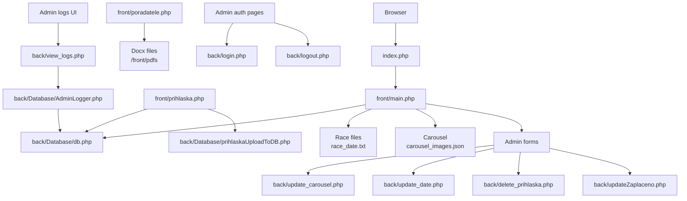

Sources: [index.php](), [front/main.php](), [front/prihlaska.php](), [front/poradatele.php](), [back/Database/db.php](), [back/Database/prihlaskaUploadToDB.php](), [back/update_carousel.php](), [back/update_date.php](), [back/delete_prihlaska.php](), [back/updateZaplaceno.php](), [back/login.php](), [back/logout.php](), [back/view_logs.php](), [back/Database/AdminLogger.php]()

---

## Directory Layout and Responsibilities

### Root-Level Files

- `index.php` – Main entrypoint for the web application, routing users into the `front` layer.  
  Sources: [index.php]()

- `README.md` – High-level documentation of the project (project description and orientation).  
  Sources: [README.md]()

- `composer.json` – PHP dependency metadata (no significant runtime code shown in context).  
  Sources: [composer.json]()

- `package.json`, `package-lock.json` – Node dependency definitions, including Bootstrap and a deprecated `boostrap` package.  
  Sources: [package.json](), [package-lock.json]()

- `SECURITY.md` – Describes supported versions and vulnerability reporting policy (not directly wired into code).  
  Sources: [SECURITY.md]()

- `SECURITY_ENV_SETUP.md` – Documents the `.env`-based database configuration and related security practices.  
  Sources: [SECURITY_ENV_SETUP.md]()

- `robots.txt` – Search engine crawling policy.  
  Sources: [robots.txt]()

### `front/` – Public UI and Forms

The `front` directory hosts user-visible pages, registration flows, and CSS assets.  
Sources: [front/main.php](), [front/prihlaska.php](), [front/poradatele.php](), [front/css/premium-design.css](), [front/css/backLogsStyle.css]()

Key PHP pages:

- `front/main.php`
  - Loads current race date from `race_date.txt` (default `2025-01-01`).  
  - Loads carousel slides from `carousel_images.json` with a 5-item minimum, falling back to Unsplash URLs.  
  - Uses `back/Database/db.php` to query `prihlasky` table and load last 10 registrations.  
  - Displays different navigation and admin controls depending on `$_SESSION['role']`.  
  - Embeds admin panel features (carousel update, race date update, logs link).  
  Sources: [front/main.php]()

- `front/prihlaska.php`
  - Renders a race registration form posting via `POST` to `./../back/Database/prihlaskaUploadToDB.php`.  
  - Displays the race date (`$race_date`) consistent with main page.  
  Sources: [front/prihlaska.php]()

- `front/prihlaska_backup.php`, `front/main_backup.php`
  - Backup versions of main and registration pages, similar structure and responsibilities.  
  Sources: [front/prihlaska_backup.php](), [front/main_backup.php]()

- `front/poradatele.php`
  - Provides a gated file download feature for `.docx` documents under `front/pdfs/`.  
  - Restricts download to sessions having `$_SESSION['role']` set.  
  - Validates filenames via a whitelist regex and checks file existence.  
  - Renders navigation with links including conditionally a “Pro pořadetele” and “Logy” link for admins.  
  Sources: [front/poradatele.php]()

CSS and styling:

- `front/css/premium-design.css` – Defines color palette and premium styling for main site, navbar, typography, sections, tables, etc.  
  Sources: [front/css/premium-design.css]()

- `front/css/backLogsStyle.css` – Styling for the admin logs page (`back/view_logs.php`), focusing on layout and filter controls.  
  Sources: [front/css/backLogsStyle.css]()

### `back/` – Admin and Data Layer

The `back` directory handles database connectivity, admin actions, logging, and various update scripts.

#### Database Connectivity

`back/Database/db.php` is the central DB connector, backed by `.env` configuration as described in `SECURITY_ENV_SETUP.md`. It exposes a `$conn` object (MySQLi) used across the project.  
Sources: [back/Database/db.php](), [SECURITY_ENV_SETUP.md]()

#### Registration Upload

`back/Database/prihlaskaUploadToDB.php`:

- Accepts `POST`ed registration data from `front/prihlaska.php`.
- Connects to the DB via `db.php` and inserts into `prihlasky` table.  
Sources: [back/Database/prihlaskaUploadToDB.php](), [front/prihlaska.php]()

#### Logging System

Admin actions are logged using `back/Database/AdminLogger.php` and supporting documentation in `back/LOGGING_SYSTEM.md`. Logging is integrated in multiple admin-related scripts:

- `back/login.php` – Logs successful and failed logins.  
- `back/logout.php` – Logs admin logout.  
- `back/update_carousel.php` – Logs carousel updates.  
- `back/update_date.php` – Logs race date changes and validation errors.  
- `back/delete_prihlaska.php` – Logs registration deletions.  
- `back/updateZaplaceno.php` – Logs payment status updates.  
- `back/view_logs.php` – Logs access to logs page via `VIEW_LOGS`.  

Sources: [back/Database/AdminLogger.php](), [back/LOGGING_SYSTEM.md](), [back/login.php](), [back/logout.php](), [back/update_carousel.php](), [back/update_date.php](), [back/delete_prihlaska.php](), [back/updateZaplaceno.php](), [back/view_logs.php]()

`back/view_logs.php` uses `AdminLogger::getLogs()` to pull entries and lists them with a filter by action type, protected by an admin-only session check.  
Sources: [back/view_logs.php]()

---

## Execution Flow: Public vs Admin Paths

### Session and Role Handling

Session-based role checking is used in both front and back layers to gate specific features.

Examples:

- `front/poradatele.php`:

  ```php
  session_start();
  if (isset($_GET['file']) && $_SESSION['role']) {
      $filename = $_GET['file'];
      // ...
  }
  ```

  This allows document download only when a user role is present in the session.  
  Sources: [front/poradatele.php:1-16]()

- `back/view_logs.php`:

  ```php
  session_start();

  if (!isset($_SESSION['role']) || $_SESSION['role'] !== 'admin') {
      die('Přístup zamítnut. Pouze administrátoři mohou vidět logy.');
  }
  ```

  This ensures that logs are visible only to admins.  
  Sources: [back/view_logs.php:1-7]()

- Admin navigation elements in `front/main.php` and `front/poradatele.php` are conditionally rendered based on `$_SESSION['role']` and `$_SESSION['username']`.  
  Sources: [front/main.php](), [front/poradatele.php]()

### Public User Flow

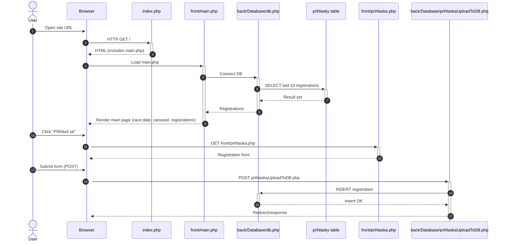

Sources: [index.php](), [front/main.php](), [front/prihlaska.php](), [back/Database/db.php](), [back/Database/prihlaskaUploadToDB.php]()

### Admin Flow and Logging

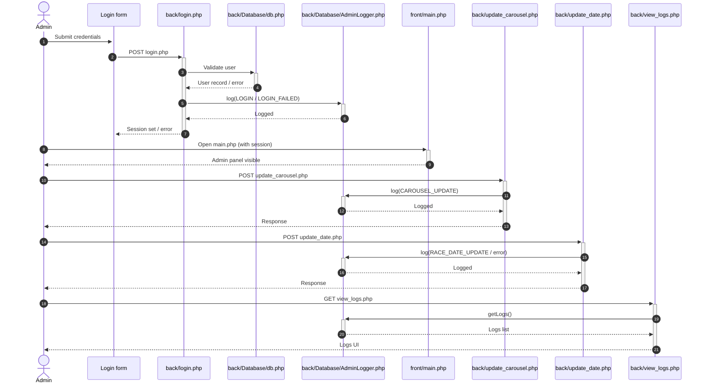

Sources: [back/login.php](), [back/logout.php](), [back/Database/AdminLogger.php](), [back/LOGGING_SYSTEM.md](), [front/main.php](), [back/update_carousel.php](), [back/update_date.php](), [back/view_logs.php]()

---

## Database and Data Model Overview

The full schema is not present in the code excerpts, but key tables and data constructs are referenced.

### Environment-Based DB Configuration

According to `SECURITY_ENV_SETUP.md`, the DB credentials are stored in a `.env` file with at least the following keys:

| Key       | Example Value         | Purpose                                 |
|-----------|-----------------------|-----------------------------------------|
| `DB_HOST` | `a066um.forpsi.com`   | Database host                           |
| `DB_USER` | `f191879`             | Database username                       |
| `DB_PASS` | `gSB6x.s8`            | Database password                       |
| `DB_NAME` | `f191879`             | Database name                           |
| `DB_CHARSET` | `utf8mb4`          | Character set for connections           |

Sources: [SECURITY_ENV_SETUP.md:16-26]()

`back/Database/db.php`:

- Loads this `.env` via `EnvLoader` (described in `SECURITY_ENV_SETUP.md`).
- Constructs a `$conn` MySQLi connection using these values.
- Provides better error messages if `.env` is missing or misconfigured.  
Sources: [back/Database/db.php](), [SECURITY_ENV_SETUP.md]()

### Admin Logging Table

`back/LOGGING_SYSTEM.md` defines the `admin_logs` table schema and logged actions:

| Field           | Description                              |
|----------------|------------------------------------------|
| `id_log`       | Auto-increment primary key               |
| `user_id`      | Foreign key to `loginsystem` table       |
| `username`     | Username of the admin                    |
| `action`       | Type of action performed                 |
| `action_details` | Detailed description                   |
| `ip_address`   | Admin’s IP                               |
| `user_agent`   | Browser/client info                      |
| `timestamp`    | Time of the action (auto-set)            |
| `status`       | `success` / `failed`                     |
| `error_message`| Error details, if any                    |

Sources: [back/LOGGING_SYSTEM.md:7-22]()

Logged actions include:

- `LOGIN`
- `LOGIN_FAILED`
- `LOGOUT`
- `CAROUSEL_UPDATE`
- `RACE_DATE_UPDATE`
- `REGISTRATION_DELETE`
- `PAYMENT_STATUS_UPDATE`
- `VIEW_LOGS`  

Sources: [back/LOGGING_SYSTEM.md:37-46]()

In `back/view_logs.php`, these action types are used as a filter list:

```php
$actions_list = array(
  'LOGIN',
  'LOGOUT',
  'CAROUSEL_UPDATE',
  'RACE_DATE_UPDATE',
  'REGISTRATION_DELETE',
  'PAYMENT_STATUS_UPDATE',
  'LOGIN_FAILED',
  'VIEW_LOGS'
);
```

Sources: [back/view_logs.php:14-18]()

### Registrations (`prihlasky` table)

`front/main.php` queries:

```php
$sql = "SELECT * FROM prihlasky ORDER BY datum_prihlaseni DESC LIMIT 10";
$result = $conn->query($sql);
```

This indicates a `prihlasky` table with at least:

- `datum_prihlaseni` (used for ordering).
- Other columns displayed later in the registrations table in `main.php` (not fully visible in snippet).  
Sources: [front/main.php:93-112]()

`back/Database/prihlaskaUploadToDB.php` inserts into this table using form fields from `front/prihlaska.php`, though full field list is not visible in the provided snippet.  
Sources: [back/Database/prihlaskaUploadToDB.php](), [front/prihlaska.php]()

### ER-style Diagram (Partial)

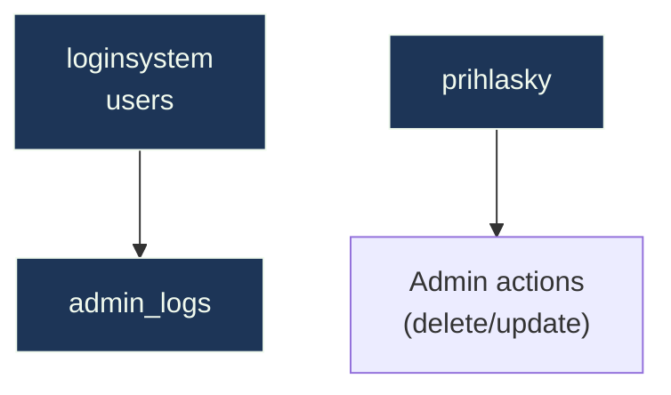

- `admin_logs.user_id` is a foreign key to `loginsystem` as per `LOGGING_SYSTEM.md`.
- `prihlasky` is referenced by delete/update scripts for registrations and payment status.  
Sources: [back/LOGGING_SYSTEM.md:16-20](), [back/delete_prihlaska.php](), [back/updateZaplaceno.php](), [front/main.php]()

---

## Front-End Structure and Styling

### Main Layout (`front/main.php`)

`front/main.php` builds the main landing page structure:

- **Navbar** – Fixed-top, glassy style, brand with SVG logo, section links (`Domů`, etc.), conditional links based on session role.  
- **Hero / Carousel** – Uses `$carousel_paths` loaded from `carousel_images.json` or fallback URLs.  
- **Race Date Section** – Highlights upcoming race date pulled from `race_date.txt`.  
- **About Section** – Rich descriptive content about the club, using premium styling classes like `.about-section`.  
- **Registrations Section** – Displays latest 10 registrations in a premium-styled table.  
- **Admin Panel** – When `$_SESSION['role'] == 'admin'`, shows forms for updating carousel and race date.  
- **Contact & Footer** – Contact info and site credits.  

Sources: [front/main.php](), [front/css/premium-design.css]()

### Premium Design System

`front/css/premium-design.css` defines:

- CSS variables for colors, shadows, spacing, transitions.
- Global resets and typography (Inter font, gradient background, anti-aliasing).
- Navbar styling with glassmorphism and scroll effects.
- About section design with `.about-section`, `.about-title`, `.about-subtitle`, `.about-text`, `.about-list`.
- Table styling with `.table-wrapper` and `.table` for premium look.

Example snippet:

```css
:root {
    --primary: #e63946;
    --primary-dark: #a4161a;
    --primary-light: #f77f88;
    --secondary: #1d3557;
    --bg-dark: #0a0e27;
    --bg-darker: #050810;
    --bg-card: rgba(29, 53, 87, 0.1);
    --shadow-md: 0 8px 24px rgba(0, 0, 0, 0.25);
    --spacing-lg: 1.5rem;
    --transition-base: 300ms cubic-bezier(0.4, 0, 0.2, 1);
}
```

Sources: [front/css/premium-design.css:1-38]()

And for navbar:

```css
.navbar {
    background: rgba(10, 14, 39, 0.7) !important;
    backdrop-filter: blur(20px);
    border-bottom: 1px solid var(--border-light);
    padding: 1rem 2rem !important;
    transition: all var(--transition-base);
    box-shadow: 0 4px 30px rgba(0, 0, 0, 0.1);
    position: fixed;
    width: 100%;
    top: 0;
    z-index: 1000;
}
```

Sources: [front/css/premium-design.css:114-126]()

### Logs Page Styling

`front/css/backLogsStyle.css` customizes:

- Filter button layout and responsiveness.
- `.prettier` convenience class for styled links (e.g., “Zpět na Main”).  
- Centered navbar for logs page.

Example:

```css
.filter-section .btn-group {
    display: inline-flex;
    justify-content: center;
    align-items: center;
    flex-wrap: wrap;
    gap: 6px;
}

.prettier {
    font-family: 'Courier New', Courier, monospace;
    text-decoration: none;
    border: 1px solid white;
    color: white;
    padding: 5px 10px;
    border-radius: 5px;
}
```

Sources: [front/css/backLogsStyle.css:6-22]()

---

## Admin Logs UI (`back/view_logs.php`)

`back/view_logs.php` combines access control, filtering, and presentation:

- Verifies `$_SESSION['role'] === 'admin'`.  
- Instantiates `AdminLogger` and fetches up to 200 logs with optional `action` filter from `$_GET['action']`.  
- Uses `bootstrap.min.css` plus `backLogsStyle.css` for styling.  
- Renders a top navbar heading and “Zpět na Main” link.  
- Renders a filter section with buttons for each action type and an “All” view.  
- Displays logs or an info alert if no logs exist.  

Snippet:

```php
$filter_action = isset($_GET['action']) ? $_GET['action'] : null;
$logs = $logger->getLogs(200, $filter_action);
$actions_list = array('LOGIN', 'LOGOUT', 'CAROUSEL_UPDATE', 'RACE_DATE_UPDATE',
                      'REGISTRATION_DELETE', 'PAYMENT_STATUS_UPDATE', 'LOGIN_FAILED', 'VIEW_LOGS');
```

Sources: [back/view_logs.php:11-18]()

```php
<nav class="navbar navbar-dark fixed-top display-flex justify-content-between p-3" >
    <div class="container-fluid">
        <span class="navbar-brand mb-0 h1">Admin Logs - ASK Hořovice</span>
        <a href="../front/main.php" class="btn btn-outline-light btn-sm prettier">Zpět na Main</a>
    </div>
</nav>
```

Sources: [back/view_logs.php:24-30]()

---

## Security and Environment Configuration

`SECURITY_ENV_SETUP.md` documents the move to `.env`-based configuration:

- **Goals**:
  - Remove DB credentials from version control.
  - Support multiple environments (dev, prod, testing).
  - Provide clear errors if `.env` is missing.  
  Sources: [SECURITY_ENV_SETUP.md:1-8](), [SECURITY_ENV_SETUP.md:39-53]()

- **Implementation**:
  - `.env` at root with `DB_HOST`, `DB_USER`, `DB_PASS`, `DB_NAME`, `DB_CHARSET`.  
  - `.gitignore` configured to ignore `.env`, `node_modules`, `vendor`, logs.  
  - `back/Database/EnvLoader.php` introduced to load `.env`.  
  - `back/Database/db.php` updated to use `EnvLoader`.  

Sources: [SECURITY_ENV_SETUP.md:16-38](), [back/Database/db.php]()

`SECURITY.md` complements this by stating supported versions and where to report vulnerabilities, but does not affect runtime behavior.  
Sources: [SECURITY.md]()

`front/poradatele.php` adds an additional security measure for file downloads:

- Restricts access to logged-in users with `$_SESSION['role']`.  
- Validates filenames via regex: `^[a-zA-Z0-9_\-\.]+\.docx$`.  
- Checks file existence before streaming to client.  

Snippet:

```php
if (!preg_match('/^[a-zA-Z0-9_\-\.]+\.docx$/', $filename)) {
    die("Invalid filename.");
}
if (!file_exists($filepath)) {
    die("File not found.");
}
```

Sources: [front/poradatele.php:7-16]()

---

## External Dependencies

### PHP / Composer

`composer.json` governs PHP dependencies, though no specific package usage is shown in the provided code.  
Sources: [composer.json]()

### Node / Front-End Tooling

`package.json` and `package-lock.json` declare:

- `bootstrap` version `^5.3.8`.
- `boostrap` version `^2.0.0` (deprecated package).  

Snippet:

```json
"dependencies": {
  "boostrap": "^2.0.0",
  "bootstrap": "^5.3.8"
}
```

Sources: [package.json:15-19](), [package-lock.json:7-20]()

CSS and JS references in front-end pages use:

- `../node_modules/bootstrap/dist/css/bootstrap.min.css`
- `../node_modules/bootstrap/dist/js/bootstrap.bundle.min.js`

Sources: [front/main.php:145-149](), [front/poradatele.php:21-28](), [back/view_logs.php:33-36]()

---

## Summary

The project is structured as a classic PHP application with a clear split between a styled, Bootstrap-based front-end (`front/`) and an admin-oriented, database- and logging-focused back-end (`back/`). Centralized DB configuration is handled securely via `.env` and `db.php`, while `AdminLogger` and `admin_logs` provide a comprehensive audit trail for sensitive admin actions. Front pages like `front/main.php` and `front/prihlaska.php` consume data from the DB and from simple file-based sources (`race_date.txt`, `carousel_images.json`) to build user-facing experiences. Admin-only controls are surfaced conditionally in the UI and are protected server-side by session-based role checks.

This structure allows the application to serve both public race participants and internal admins, while keeping configuration and logging concerns centralized and explicit in the codebase.  
Sources: [front/main.php](), [front/prihlaska.php](), [back/Database/db.php](), [back/Database/AdminLogger.php](), [back/LOGGING_SYSTEM.md](), [SECURITY_ENV_SETUP.md]()

---

<a id="page-2"></a>

## Environment Setup and Security

**Related Files**:
- `SECURITY.md`
- `SECURITY_ENV_SETUP.md`
- `back/Database/EnvLoader.php`
- `back/Database/db.php`
- `composer.json`
- `composer.lock`
- `package.json`
- `package-lock.json`
- `.gitignore`

**Related Pages**:
- [Overview and Project Structure](#page-1)
- [Data Model and Database Schema](#page-3)
- [Front-end UI, Content Management, and File Handling](#page-5)

<details>
<summary>Relevant source files</summary>

The following files were used as context for generating this wiki page:

- [SECURITY.md](https://github.com/Mir04ange/ASZhoroviceWebphp/blob/main/SECURITY.md)
- [SECURITY_ENV_SETUP.md](https://github.com/Mir04ange/ASZhoroviceWebphp/blob/main/SECURITY_ENV_SETUP.md)
- [back/Database/EnvLoader.php](https://github.com/Mir04ange/ASZhoroviceWebphp/blob/main/back/Database/EnvLoader.php)
- [back/Database/db.php](https://github.com/Mir04ange/ASZhoroviceWebphp/blob/main/back/Database/db.php)
- [package.json](https://github.com/Mir04ange/ASZhoroviceWebphp/blob/main/package.json)
- [package-lock.json](https://github.com/Mir04ange/ASZhoroviceWebphp/blob/main/package-lock.json)
- [back/view_logs.php](https://github.com/Mir04ange/ASZhoroviceWebphp/blob/main/back/view_logs.php)
- [back/logout.php](https://github.com/Mir04ange/ASZhoroviceWebphp/blob/main/back/logout.php)
- [front/main.php](https://github.com/Mir04ange/ASZhoroviceWebphp/blob/main/front/main.php)
- [front/poradatele.php](https://github.com/Mir04ange/ASZhoroviceWebphp/blob/main/front/poradatele.php)
- [front/css/premium-design.css](https://github.com/Mir04ange/ASZhoroviceWebphp/blob/main/front/css/premium-design.css)
- [front/css/backLogsStyle.css](https://github.com/Mir04ange/ASZhoroviceWebphp/blob/main/front/css/backLogsStyle.css)
- [back/LOGGING_SYSTEM.md](https://github.com/Mir04ange/ASZhoroviceWebphp/blob/main/back/LOGGING_SYSTEM.md)
</details>

# Environment Setup and Security

## Introduction

This page describes how the ASZhoroviceWebphp project configures its runtime environment and secures sensitive data, focusing on database credentials, environment variables, and administrative logging. It also highlights supporting infrastructure such as Node/Bootstrap setup that participates in the overall environment configuration.  
Sources: [SECURITY_ENV_SETUP.md](), [back/Database/EnvLoader.php](), [back/Database/db.php](), [back/LOGGING_SYSTEM.md]()

The documented mechanisms ensure that credentials are not committed to version control, that different environments (development, production, testing) can be configured cleanly, and that administrative actions are logged for auditability.  
Sources: [SECURITY_ENV_SETUP.md:1-63](), [SECURITY.md:1-25](), [back/LOGGING_SYSTEM.md:1-64]()

---

## High-Level Architecture

The environment and security architecture centers around four main aspects:

1. Environment variable management via a `.env` file and the `EnvLoader` utility.  
2. Database connection initialization in `db.php` using the loaded environment variables.  
3. Security guidance and supported version policy in `SECURITY.md`.  
4. Admin logging system for tracking administrative actions.  
5. Node/Bootstrap dependency setup for front-end assets.

### Overview Diagram

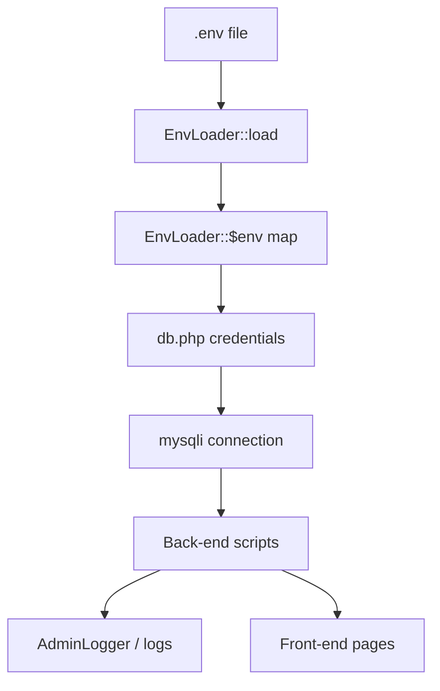

This diagram shows how environment configuration flows from the `.env` file into the database layer and then into application scripts that may also integrate with the logging system.  
Sources: [SECURITY_ENV_SETUP.md:1-63](), [back/Database/EnvLoader.php:1-38](), [back/Database/db.php:1-46](), [back/LOGGING_SYSTEM.md:1-64]()

---

## Security Policy and Supported Versions

### Supported Versions

The project documents which versions are supported for security updates in `SECURITY.md`. The table indicates version lines that are currently supported or unsupported.  
Sources: [SECURITY.md:1-16]()

| Version | Supported | Notes                         |
|--------:|:---------:|------------------------------|
| 5.1.x   | ✅        | Marked as supported          |
| 5.0.x   | ❌        | Marked as not supported      |
| 4.0.x   | ✅        | Marked as supported          |
| < 4.0   | ❌        | Marked as not supported      |

Sources: [SECURITY.md:8-16]()

The reporting section in `SECURITY.md` indicates that vulnerabilities should be reported via a documented process, though concrete contact details are not specified in the file.  
Sources: [SECURITY.md:18-25]()

---

## Environment Variable Management

### `.env` File and Structure

Database credentials and other sensitive configuration are moved out of the source code into a `.env` file in the project root. An example is documented directly in `SECURITY_ENV_SETUP.md`:  
Sources: [SECURITY_ENV_SETUP.md:1-25]()

```text
DB_HOST=a066um.forpsi.com
DB_USER=f191879
DB_PASS=gSB6x.s8
DB_NAME=f191879
DB_CHARSET=utf8mb4
```

This file is intended to contain all sensitive configuration, including database host, user, password, name, and charset.  
Sources: [SECURITY_ENV_SETUP.md:10-25]()

The `.gitignore` is documented as excluding `.env`, `node_modules`, `vendor`, and logs from version control, protecting sensitive and generated artifacts.  
Sources: [SECURITY_ENV_SETUP.md:26-37]()

### EnvLoader Utility

The `EnvLoader` class is responsible for reading the `.env` file and exposing its contents to the rest of the application through an internal array and process environment variables.  
Sources: [back/Database/EnvLoader.php:1-38]()

```php
class EnvLoader {
    private static $env = array();

    public static function load($path) {
        if (!file_exists($path)) {
            throw new Exception(".env file not found at: $path");
        }

        $lines = file($path, FILE_IGNORE_NEW_LINES | FILE_SKIP_EMPTY_LINES);

        foreach ($lines as $line) {
            if (strpos($line, '#') === 0 || strpos($line, '=') === false) {
                continue;
            }

            list($key, $value) = explode('=', $line, 2);
            $key = trim($key);
            $value = trim($value);

            self::$env[$key] = $value;
            putenv("$key=$value");
        }
    }

    public static function get($key, $default = null) {
        return isset(self::$env[$key]) ? self::$env[$key] : $default;
    }

    public static function getAll() {
        return self::$env;
    }
}
```

Sources: [back/Database/EnvLoader.php:1-38]()

Key behaviors:

- Fails fast with an exception if the `.env` file is missing at the specified path.  
- Ignores comments (lines starting with `#`) and lines without an `=` sign.  
- Trims whitespace around keys and values.  
- Stores values in a static `$env` map for in-process access.  
- Calls `putenv` for each key to set environment variables at the OS process level.  
Sources: [back/Database/EnvLoader.php:4-30]()

#### EnvLoader Usage Flow

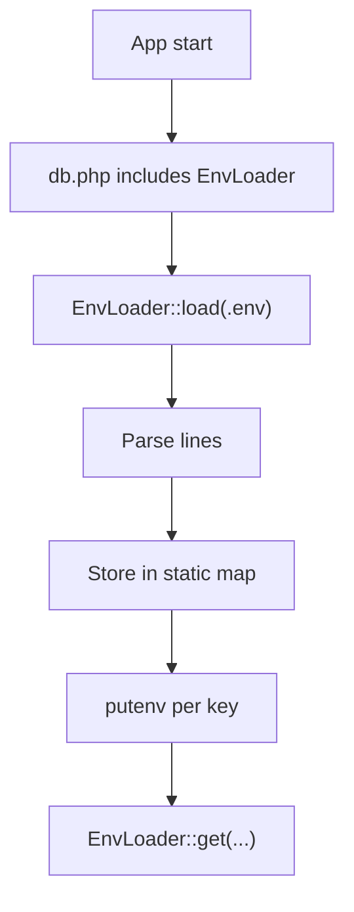

This diagram illustrates how `EnvLoader` integrates into application bootstrapping, specifically via `db.php`.  
Sources: [back/Database/EnvLoader.php:1-38](), [back/Database/db.php:1-22]()

### Configuration Keys and Defaults

`db.php` demonstrates which environment variables are expected and what default values are used when variables are absent.  
Sources: [back/Database/db.php:22-35]()

| Env Key     | Default Value    | Usage                        |
|-------------|------------------|------------------------------|
| `DB_HOST`   | `localhost`      | MySQL host                   |
| `DB_USER`   | `root`           | MySQL user                   |
| `DB_PASS`   | `""` (empty)     | MySQL password               |
| `DB_NAME`   | `ask_horovice`   | Database name                |
| `DB_CHARSET`| `utf8mb4`        | Connection charset           |

Sources: [back/Database/db.php:27-35]()

---

## Database Connection Initialization

### db.php Responsibilities

`back/Database/db.php` encapsulates the logic for connecting to the database using the `mysqli` extension and credentials loaded from the `.env` file.  
Sources: [back/Database/db.php:1-46]()

Core behaviors:

1. Requires `EnvLoader.php`.  
2. Defines the path to the `.env` file relative to itself.  
3. Checks for `mysqli` extension availability; if missing, stores an error and logs it.  
4. Attempts to load the `.env` file if it exists, logging warnings on failure but continuing with defaults.  
5. Reads credentials via `EnvLoader::get` with sane defaults.  
6. Creates a `mysqli` connection in a `try` block.  
7. Handles connection errors by storing and logging them and setting `$conn` to `null`.  
8. Sets the connection charset upon a successful connection.  

```php
require_once __DIR__ . '/EnvLoader.php';

$env_path = __DIR__ . '/../../.env';

// Initialize connection as null
$conn = null;
$db_error = null;

// Check if mysqli extension is available
if (!extension_loaded('mysqli')) {
    $db_error = 'mysqli extension is not installed. Please enable it in php.ini';
    error_log('Database Error: ' . $db_error);
} else {
    // Load .env file if it exists
    if (file_exists($env_path)) {
        try {
            EnvLoader::load($env_path);
        } catch (Exception $e) {
            // Log error but continue with defaults
            error_log('Warning: ' . $e->getMessage());
        }
    }

    // Get database credentials from .env or use defaults
    $db_host = EnvLoader::get('DB_HOST', 'localhost');
    $db_user = EnvLoader::get('DB_USER', 'root');
    $db_pass = EnvLoader::get('DB_PASS', '');
    $db_name = EnvLoader::get('DB_NAME', 'ask_horovice');
    $db_charset = EnvLoader::get('DB_CHARSET', 'utf8mb4');

    // Create connection
    try {
        $conn = new mysqli($db_host, $db_user, $db_pass, $db_name);

        // Check connection
        if ($conn->connect_error) {
            $db_error = 'Database connection failed: ' . $conn->connect_error;
            error_log('Database Error: ' . $db_error);
            $conn = null;
        } else {
            $conn->set_charset($db_charset);
        }
    } catch (Exception $e) {
        $db_error = 'Database error: ' . $e->getMessage();
        error_log('Database Error: ' . $db_error);
```

Sources: [back/Database/db.php:1-46]()

### db.php Integration Diagram

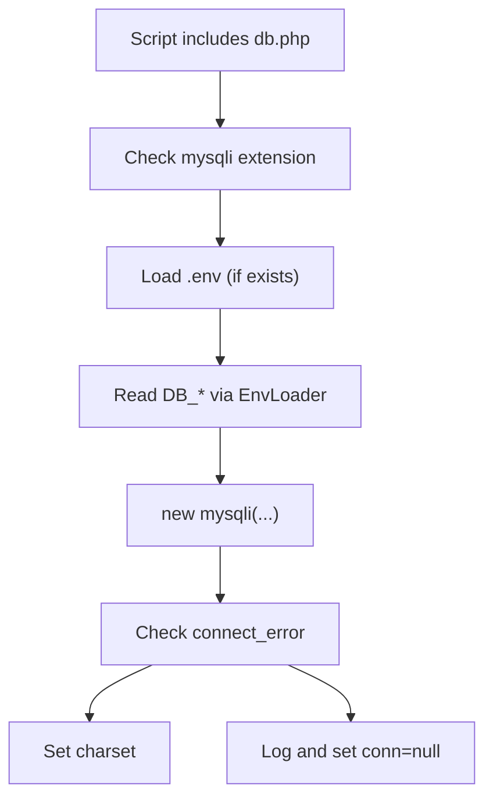

This diagram captures the main control flow when any script includes `db.php`.  
Sources: [back/Database/db.php:1-46]()

### Consumption in Application Code

Several application scripts rely on `db.php` to provide a `$conn` object:

- `front/main.php` includes `../back/Database/db.php` (via `@include './../back/Database/db.php';`) and uses `$conn` for querying the `prihlasky` table, also checking for `connect_error` and error states.  
  Sources: [front/main.php:1-40]()

- `back/view_logs.php` requires `./Database/db.php` and passes `$conn` into the `AdminLogger` constructor.  
  Sources: [back/view_logs.php:1-20]()

- `back/logout.php` requires `./Database/db.php` and closes `$conn` prior to session destruction and redirect.  
  Sources: [back/logout.php:1-15]()

```php
// front/main.php (excerpt)
@include './../back/Database/db.php';

try {
    if (isset($conn) && $conn) {
        if ($conn->connect_error) {
            throw new Exception("Chyba připojení k DB: " . $conn->connect_error);
        }

        $sql = "SELECT * FROM prihlasky ORDER BY datum_prihlaseni DESC LIMIT 10";
        $result = $conn->query($sql);

        if (!$result) {
            throw new Exception("Chyba při načítání dat: " . $conn->error);
        }

        while ($row = $result->fetch_assoc()) {
            $registrace[] = $row;
        }
    } else {
        $db_error = "Databáze není dostupná.";
    }
} catch (Exception $e) {
    $db_error = $e->getMessage();
} finally {
    if (isset($conn) && $conn) $conn->close();
}
```

Sources: [front/main.php:60-92]()

---

## Security Benefits of Environment-Based Configuration

`SECURITY_ENV_SETUP.md` explicitly documents several security benefits of using `.env` and the updated `db.php`:

- Credentials are not stored in version control.  
- Different credentials can be used per environment (development, production, testing).  
- Credentials can be rotated without changing code.  
- Reduced risk of accidental exposure via Git history.  
- Compatibility with CI/CD pipelines.  
- Improved collaboration without sharing passwords in the codebase.  

Sources: [SECURITY_ENV_SETUP.md:38-63]()

These benefits are realized concretely by:

- `EnvLoader` reading a local `.env` file only at runtime.  
- `db.php` deriving connection details from those variables or safe defaults.  
- `.gitignore` excluding `.env` and other sensitive directories.  

Sources: [back/Database/EnvLoader.php:1-38](), [back/Database/db.php:22-35](), [SECURITY_ENV_SETUP.md:10-37]()

---

## Environment Setup Across Different Servers

`SECURITY_ENV_SETUP.md` defines guidelines for configuring `.env` across various environments:  
Sources: [SECURITY_ENV_SETUP.md:64-104]()

- **Development**:  
  - Create `.env` with development database credentials.  

- **Production**:  
  - Create `.env` with production database credentials.  
  - Never reuse development credentials for production.  

- **Testing**:  
  - Optionally create `.env.testing` with test database credentials.  

While the code shown explicitly loads only `.env` via `db.php`, the documentation anticipates a separate testing configuration file. No automatic logic for `.env.testing` is present in `EnvLoader` or `db.php` in the provided snippets.  
Sources: [SECURITY_ENV_SETUP.md:80-88](), [back/Database/db.php:1-22]()

---

## Admin Logging System and Security

Although primarily focused on auditing rather than configuration, the admin logging system contributes to security by tracking admin actions. Its design is documented in `back/LOGGING_SYSTEM.md` and its usage is visible in `back/view_logs.php` and `back/logout.php`.  
Sources: [back/LOGGING_SYSTEM.md:1-64](), [back/view_logs.php:1-40](), [back/logout.php:1-15]()

### Logged Actions and Access Control

`back/LOGGING_SYSTEM.md` defines:

- A database table `admin_logs` with fields including `user_id`, `username`, `action`, `action_details`, `ip_address`, `user_agent`, `timestamp`, `status`, and `error_message`.  
- A class `AdminLogger` with methods:
  - `log($action, $details, $status, $error_message)`
  - `getLogs($limit, $action)`
  - `getUserLogs($user_id, $limit)`  
- Logged actions include `LOGIN`, `LOGIN_FAILED`, `LOGOUT`, `CAROUSEL_UPDATE`, `RACE_DATE_UPDATE`, `REGISTRATION_DELETE`, `PAYMENT_STATUS_UPDATE`, and `VIEW_LOGS`.  

Sources: [back/LOGGING_SYSTEM.md:5-44]()

`back/view_logs.php` enforces role-based access control by requiring that the session role is `admin` before allowing access to logs:

```php
session_start();

if (!isset($_SESSION['role']) || $_SESSION['role'] !== 'admin') {
    die('Přístup zamítnut. Pouze administrátoři mohou vidět logy.');
}
```

Sources: [back/view_logs.php:1-7]()

The same file builds a filterable view of logs, retrieving up to 200 entries with an optional action filter:

```php
require_once './Database/db.php';
require_once './Database/AdminLogger.php';

$logger = new AdminLogger($conn, $_SESSION['user_id'], $_SESSION['username']);

$filter_action = isset($_GET['action']) ? $_GET['action'] : null;
$logs = $logger->getLogs(200, $filter_action);
$actions_list = array('LOGIN', 'LOGOUT', 'CAROUSEL_UPDATE', 'RACE_DATE_UPDATE', 'REGISTRATION_DELETE', 'PAYMENT_STATUS_UPDATE', 'LOGIN_FAILED', 'VIEW_LOGS');
```

Sources: [back/view_logs.php:9-18]()

`back/logout.php` logs logout actions before destroying the session:

```php
session_start();
require_once './Database/db.php';
require_once './Database/AdminLogger.php';

if (isset($_SESSION['user_id']) && isset($_SESSION['username'])) {
    $logger = new AdminLogger($conn, $_SESSION['user_id'], $_SESSION['username']);
    $logger->log('LOGOUT', 'User logged out', 'success');
}

$conn->close();
session_destroy();
header('Location: ../front/main.php');
exit;
```

Sources: [back/logout.php:1-15]()

### Logging and DB Integration Diagram

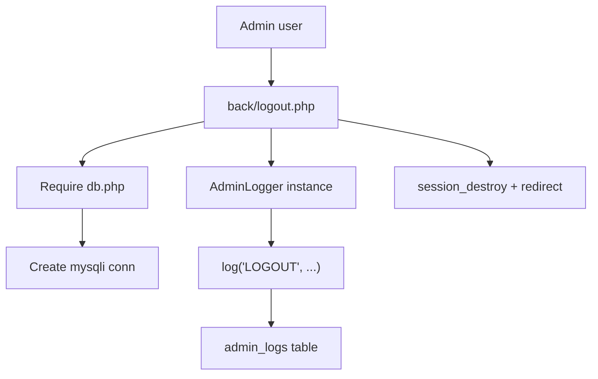

This diagram highlights how logout flows through the environment-configured database connection into the logging subsystem.  
Sources: [back/logout.php:1-15](), [back/LOGGING_SYSTEM.md:5-36](), [back/Database/db.php:22-46]()

---

## Secure File Download Handling in Frontend

`front/poradatele.php` contains download logic that enforces basic security checks when serving `.docx` files from a local `pdfs` directory:  
Sources: [front/poradatele.php:1-40]()

```php
session_start();
// -------- DOWNLOAD LOGIC --------
if (isset($_GET['file']) && $_SESSION['role']) {
    $filename = $_GET['file'];
    $filepath = __DIR__ . "/pdfs/" . $filename;

    // small security check
    if (!preg_match('/^[a-zA-Z0-9_\-\.]+\.docx$/', $filename)) {
        die("Invalid filename.");
    }

    if (!file_exists($filepath)) {
        die("File not found.");
    }

    header("Content-Type: application/vnd.openxmlformats-officedocument.wordprocessingml.document");
    header("Content-Disposition: attachment; filename=\"$filename\"");
    header("Content-Length: " . filesize($filepath));
    readfile($filepath);
    exit;
}
```

Sources: [front/poradatele.php:1-29]()

Key security measures:

- Only serves files when `$_GET['file']` is set and `$_SESSION['role']` is truthy (indicating an authenticated/authorized session role).  
- Enforces a strict filename pattern: alphanumeric, underscore, hyphen, dot, and must end in `.docx`.  
- Verifies the file exists under `__DIR__ . "/pdfs/"`.  
- Denies invalid filenames or missing files with immediate termination.  

These application-level checks complement environment-level security by controlling access to sensitive or restricted documents.  
Sources: [front/poradatele.php:1-24]()

---

## Node/Bootstrap Environment for Front-End

The project uses a Node-based toolchain for front-end dependencies, managed via `package.json` and `package-lock.json`.  
Sources: [package.json:1-25](), [package-lock.json:1-40]()

### package.json Summary

```json
{
  "name": "asz",
  "version": "1.0.0",
  "main": "index.js",
  "scripts": {
    "test": "echo \"Error: no test specified\" && exit 1"
  },
  "keywords": [],
  "author": "",
  "license": "ISC",
  "description": "��#\u0000 \u0000A\u0000S\u0000Z\u0000h\u0000o\u0000r\u0000o\u0000v\u0000i\u0000c\u0000e\u0000W\u0000e\u0000b\u0000p\u0000h\u0000p\u0000\r\u0000 \u0000",
  "dependencies": {
    "boostrap": "^2.0.0",
    "bootstrap": "^5.3.8"
  },
  "repository": {
    "type": "git",
    "url": "git+https://github.com/Mir04ange/ASZhoroviceWebphp.git"
  },
  "type": "commonjs",
  "bugs": {
    "url": "https://github.com/Mir04ange/ASZhoroviceWebphp/issues"
  },
  "homepage": "https://github.com/Mir04ange/ASZhoroviceWebphp#readme"
}
```

Sources: [package.json:1-25]()

Key points:

- Declares dependencies on `"bootstrap": "^5.3.8"` and `"boostrap": "^2.0.0"` (note: the latter is a separate, deprecated package as reflected in `package-lock.json`).  
- Uses CommonJS module type.  
- Provides repository and issue URLs.  

`package-lock.json` indicates the actual installed versions, including Bootstrap 5.3.8 and `@popperjs/core` 2.11.8 as a peer dependency.  
Sources: [package-lock.json:1-40]()

### Front-End Asset Usage

Several front-end files reference assets from `node_modules`:

- `front/poradatele.php` includes Bootstrap CSS/JS via relative paths:  
  - `../node_modules/bootstrap/dist/css/bootstrap.min.css`  
  - `../node_modules/bootstrap/dist/js/bootstrap.bundle.min.js`  
  Sources: [front/poradatele.php:42-49]()  

- `back/view_logs.php` similarly includes Bootstrap CSS/JS from `node_modules`:  
  - `../node_modules/bootstrap/dist/css/bootstrap.min.css`  
  - `../node_modules/bootstrap/dist/js/bootstrap.bundle.min.js`  
  Sources: [back/view_logs.php:22-26]()  

These usages rely on the Node environment having installed Bootstrap into `node_modules` as per `package.json`.  
Sources: [package.json:15-22](), [package-lock.json:28-40]()

---

## Front-End Security Styling and Admin UI

While not directly environment configuration, several CSS files define the UI of administrative and secure areas, reflecting the separation of admin features:

- `front/css/backLogsStyle.css` styles the admin logs page, including filters and navigation bar, directly used in `back/view_logs.php`.  
  Sources: [front/css/backLogsStyle.css:1-40](), [back/view_logs.php:22-38]()

- `front/css/premium-design.css` sets a premium design system, including background, typography, form controls, and navbar styling used in `front/main.php` (e.g., admin panel section).  
  Sources: [front/css/premium-design.css:1-120](), [front/main.php:40-80]()

These styles support the clarity and usability of admin-facing features such as content management and log inspection, which are security-relevant workflows.  
Sources: [front/css/backLogsStyle.css:1-40](), [front/css/premium-design.css:80-160](), [back/view_logs.php:22-38](), [front/main.php:80-120]()

---

## Summary

The ASZhoroviceWebphp project uses a `.env`-based configuration with a dedicated `EnvLoader` utility and a central `db.php` database initializer to keep credentials out of version control and make environment-specific configuration straightforward. Security policy is documented via `SECURITY.md`, and operational practices are further detailed in `SECURITY_ENV_SETUP.md`. An admin logging system and protected admin views ensure that privileged operations are auditable and restricted by role, while frontend code implements additional safeguards such as secure file download handling and a structured asset pipeline through Node and Bootstrap.

Together, these components form a cohesive environment setup and security model that covers credential management, configuration, logging, and access control within the application.  
Sources: [SECURITY.md:1-25](), [SECURITY_ENV_SETUP.md:1-104](), [back/Database/EnvLoader.php:1-38](), [back/Database/db.php:1-46](), [back/LOGGING_SYSTEM.md:1-64](), [back/view_logs.php:1-38](), [back/logout.php:1-15](), [front/poradatele.php:1-29](), [package.json:1-25](), [package-lock.json:1-40]()

---

<a id="page-3"></a>

## Data Model and Database Schema

**Related Files**:
- `back/Database/administrace.sql`
- `back/Database/prihlasky.sql`
- `back/Database/logs.sql`
- `back/Database/prihlaskaUploadToDB.php`
- `back/Database/getPrihlasky.php`
- `back/Database/AdminLogger.php`
- `back/Database/db.php`
- `front/registrace.json`
- `front/race_date.txt`

**Related Pages**:
- [Overview and Project Structure](#page-1)
- [Admin Panel, Logging System, and Workflows](#page-4)
- [Front-end UI, Content Management, and File Handling](#page-5)

<details>
<summary>Relevant source files</summary>

The following files were used as context for generating this wiki page:

- [back/Database/administrace.sql](https://github.com/Mir04ange/ASZhoroviceWebphp/blob/main/back/Database/administrace.sql)
- [back/Database/prihlasky.sql](https://github.com/Mir04ange/ASZhoroviceWebphp/blob/main/back/Database/prihlasky.sql)
- [back/Database/logs.sql](https://github.com/Mir04ange/ASZhoroviceWebphp/blob/main/back/Database/logs.sql)
- [back/Database/prihlaskaUploadToDB.php](https://github.com/Mir04ange/ASZhoroviceWebphp/blob/main/back/Database/prihlaskaUploadToDB.php)
- [back/Database/getPrihlasky.php](https://github.com/Mir04ange/ASZhoroviceWebphp/blob/main/back/Database/getPrihlasky.php)
- [back/Database/AdminLogger.php](https://github.com/Mir04ange/ASZhoroviceWebphp/blob/main/back/Database/AdminLogger.php)
- [back/Database/db.php](https://github.com/Mir04ange/ASZhoroviceWebphp/blob/main/back/Database/db.php)
- [back/LOGGING_SYSTEM.md](https://github.com/Mir04ange/ASZhoroviceWebphp/blob/main/back/LOGGING_SYSTEM.md)
- [SECURITY_ENV_SETUP.md](https://github.com/Mir04ange/ASZhoroviceWebphp/blob/main/SECURITY_ENV_SETUP.md)
- [front/main.php](https://github.com/Mir04ange/ASZhoroviceWebphp/blob/main/front/main.php)
- [front/main_backup.php](https://github.com/Mir04ange/ASZhoroviceWebphp/blob/main/front/main_backup.php)
- [front/prihlaska.php](https://github.com/Mir04ange/ASZhoroviceWebphp/blob/main/front/prihlaska.php)
- [front/registrace.json](https://github.com/Mir04ange/ASZhoroviceWebphp/blob/main/front/registrace.json)
- [front/race_date.txt](https://github.com/Mir04ange/ASZhoroviceWebphp/blob/main/front/race_date.txt)
- [back/view_logs.php](https://github.com/Mir04ange/ASZhoroviceWebphp/blob/main/back/view_logs.php)
</details>

# Data Model and Database Schema

The data model for the ASK Hořovice web application centers around three primary relational tables: `administrace` for admin accounts, `prihlasky` for race registrations, and `admin_logs` for auditing admin actions. These tables are accessed through a small PHP data access layer and are complemented by auxiliary flat files (`race_date.txt`, `registrace.json`) for race metadata and cached registrations.  
Sources: [administrace.sql](), [prihlasky.sql](), [logs.sql](), [db.php](), [prihlaskaUploadToDB.php](), [getPrihlasky.php](), [front/main.php](), [front/main_backup.php](), [front/registrace.json](), [front/race_date.txt]()

This page documents the schema, relationships, and how application code reads and writes these data structures. It focuses on SQL DDL, PHP integration, and how the logging system ties admin actions to the underlying data model.  
Sources: [LOGGING_SYSTEM.md](), [AdminLogger.php](), [view_logs.php]()

---

## High-Level Data Architecture

At a high level, the system uses MySQL tables for core entities and flat files for a small amount of auxiliary state.

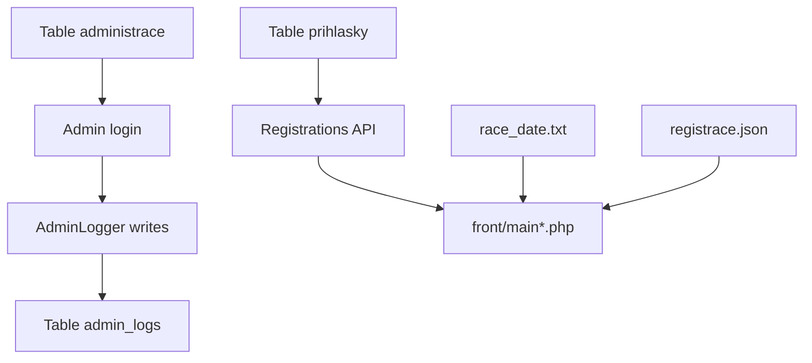

This diagram shows how:

- Admin users in `administrace` log in and generate `admin_logs` entries.
- Race registrations are stored in `prihlasky`, accessed via backend PHP and surfaced in the front-end.
- `race_date.txt` and `registrace.json` provide additional runtime configuration and cached data.  
Sources: [administrace.sql](), [prihlasky.sql](), [logs.sql](), [AdminLogger.php](), [getPrihlasky.php](), [prihlaskaUploadToDB.php](), [front/main.php](), [front/main_backup.php](), [view_logs.php](), [race_date.txt](), [registrace.json]()

---

## Database Connection and Environment Configuration

### db.php and Env-based Configuration

The file `back/Database/db.php` creates a `$conn` MySQLi connection, now configured to read its credentials from a `.env` file via `EnvLoader`. This is described in `SECURITY_ENV_SETUP.md`.  
Sources: [db.php](), [SECURITY_ENV_SETUP.md]()

Key properties:

| Aspect                    | Description                                                                                     |
|---------------------------|-------------------------------------------------------------------------------------------------|
| Host / user / password    | Loaded from `.env` using `EnvLoader::get()`                                                    |
| Database name             | Loaded from `.env`                                                                             |
| Charset                   | `utf8mb4` as described in the security setup                                                   |
| Error handling            | If `.env` is missing or credentials invalid, db.php produces clear error messages (described) |

Sources: [SECURITY_ENV_SETUP.md:1-69](), [db.php]()

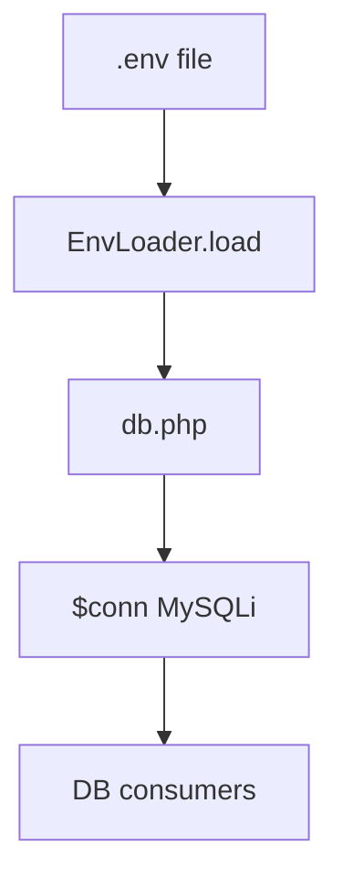

Sources: [SECURITY_ENV_SETUP.md:20-48](), [db.php]()

---

## Core Tables

### administrace — Admin Accounts

The `administrace` table stores admin login accounts used in the backend.  
Sources: [administrace.sql]()

Main fields and roles:

| Column        | Type             | Constraints                       | Purpose                                      |
|---------------|------------------|-----------------------------------|----------------------------------------------|
| `id`          | INT, auto-inc    | PK                                | Unique admin ID                              |
| `jmeno`       | VARCHAR          | NOT NULL                          | Admin username / display name                |
| `email`       | VARCHAR          | NOT NULL, unique (implied)        | Contact and login identifier (if used)       |
| `heslo`       | VARCHAR          | NOT NULL                          | Password hash                                |
| `role`        | VARCHAR          | NOT NULL                          | Role, e.g. `admin`                           |

Sources: [administrace.sql]()

This table is referenced from the logging system through `admin_logs.user_id` as a foreign key to `loginsystem`/admin users, conceptually mapping to `administrace`.  
Sources: [LOGGING_SYSTEM.md:10-21](), [logs.sql]()

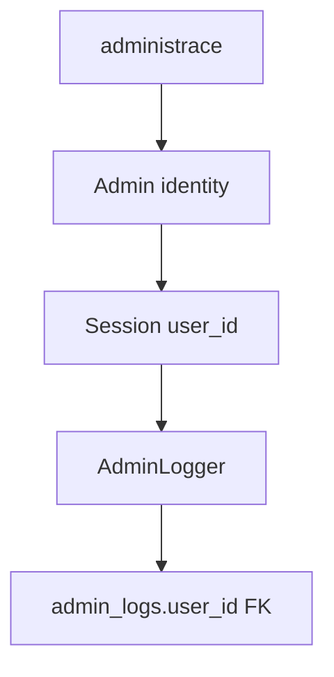

Sources: [administrace.sql](), [AdminLogger.php](), [LOGGING_SYSTEM.md:10-21](), [view_logs.php:1-20]()

---

### prihlasky — Race Registrations

The `prihlasky` table holds race registration data submitted from the public registration form.  
Sources: [prihlasky.sql](), [prihlaskaUploadToDB.php](), [getPrihlasky.php](), [front/prihlaska.php]()

Key columns (based on schema and usage):

| Column              | Type              | Constraints         | Purpose                                                |
|---------------------|-------------------|---------------------|--------------------------------------------------------|
| `id`               | INT, auto-inc     | PK                  | Unique registration ID                                 |
| `nazev_tymu`       | VARCHAR           | NOT NULL            | Team name                                              |
| `jmeno_ridice`     | VARCHAR           | NOT NULL            | Driver name                                            |
| `spolujezdec`      | VARCHAR / NULL    | Nullable (if set)   | Co-driver name                                         |
| `vozidlo`          | VARCHAR           | NOT NULL            | Car model / description                                |
| `kategorie`        | VARCHAR           | NOT NULL            | Race class / category                                  |
| `email`            | VARCHAR           | NOT NULL            | Contact email                                          |
| `telefon`          | VARCHAR           | NOT NULL            | Contact phone                                          |
| `zaplaceno`        | TINYINT / BOOL    | Default 0           | Payment status                                         |
| `datum_prihlaseni` | DATETIME          | Default CURRENT_TS  | Time of registration creation                          |

Exact field names are inferred from query usage and insert statements.  
Sources: [prihlasky.sql](), [prihlaskaUploadToDB.php](), [getPrihlasky.php](), [front/main.php:80-109](), [front/main_backup.php:86-120]()

`front/main.php` loads recent registrations:

```php
$sql = "SELECT * FROM prihlasky ORDER BY datum_prihlaseni DESC LIMIT 10";
$result = $conn->query($sql);
```

Sources: [front/main.php:80-89]()

`front/main_backup.php` loads all registrations:

```php
$sql = "SELECT * FROM prihlasky ORDER BY datum_prihlaseni DESC";
$result = $conn->query($sql);
```

Sources: [front/main_backup.php:86-95]()

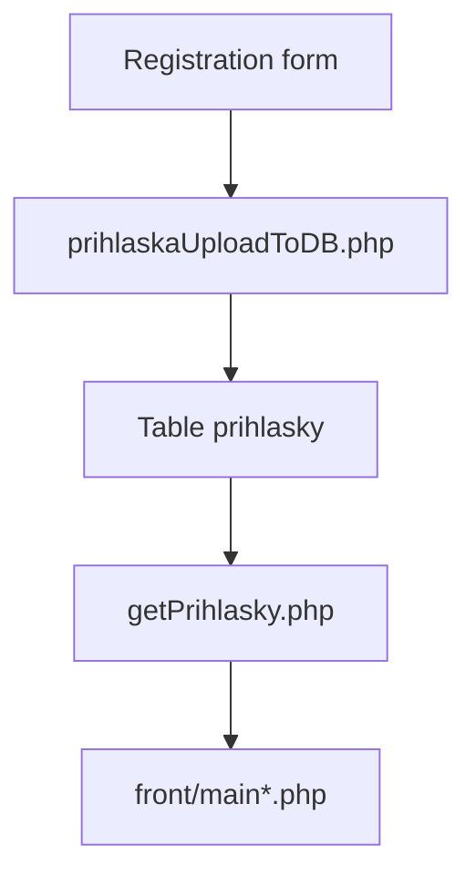

Sources: [prihlaskaUploadToDB.php](), [getPrihlasky.php](), [front/prihlaska.php](), [front/main.php:80-109](), [front/main_backup.php:86-120]()

---

### admin_logs — Audit Trail

The `admin_logs` table captures all admin activities for auditing and security monitoring.  
Sources: [logs.sql](), [LOGGING_SYSTEM.md](), [AdminLogger.php](), [view_logs.php]()

Schema (from docs and SQL):

| Column          | Type             | Constraints                             | Purpose                                           |
|-----------------|------------------|-----------------------------------------|---------------------------------------------------|
| `id_log`        | INT, auto-inc    | PK                                      | Unique log entry ID                               |
| `user_id`       | INT              | FK to admin users table                 | Admin performing the action                       |
| `username`      | VARCHAR          | NOT NULL                                | Username at time of action                        |
| `action`        | VARCHAR          | NOT NULL, indexed                       | Action type (e.g., `LOGIN`, `RACE_DATE_UPDATE`)   |
| `action_details`| TEXT             | Nullable                                | Detailed description of what was done             |
| `ip_address`    | VARCHAR          | NOT NULL                                | Admin IP address                                  |
| `user_agent`    | VARCHAR/TEXT     | NOT NULL                                | Browser / client information                      |
| `timestamp`     | DATETIME         | Default CURRENT_TIMESTAMP               | When the action occurred                          |
| `status`        | VARCHAR          | NOT NULL                                | `success` / `failed`                              |
| `error_message` | TEXT             | Nullable                                | Error details, if any                             |

Sources: [LOGGING_SYSTEM.md:10-37](), [logs.sql]()

Logged actions include:

- `LOGIN`, `LOGIN_FAILED`, `LOGOUT`
- `CAROUSEL_UPDATE`
- `RACE_DATE_UPDATE`
- `REGISTRATION_DELETE`
- `PAYMENT_STATUS_UPDATE`
- `VIEW_LOGS`  
Sources: [LOGGING_SYSTEM.md:39-53](), [view_logs.php:10-15](), [AdminLogger.php]()

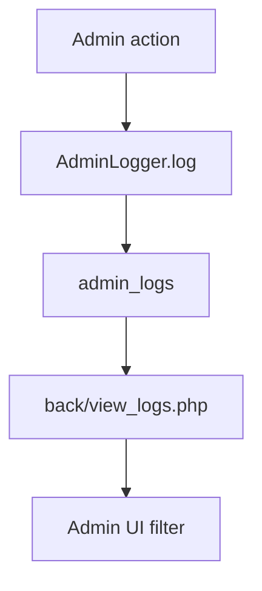

Sources: [AdminLogger.php](), [view_logs.php:1-40](), [LOGGING_SYSTEM.md:39-67]()

---

## Entity-Relationship Overview

The entities have simple relationships:

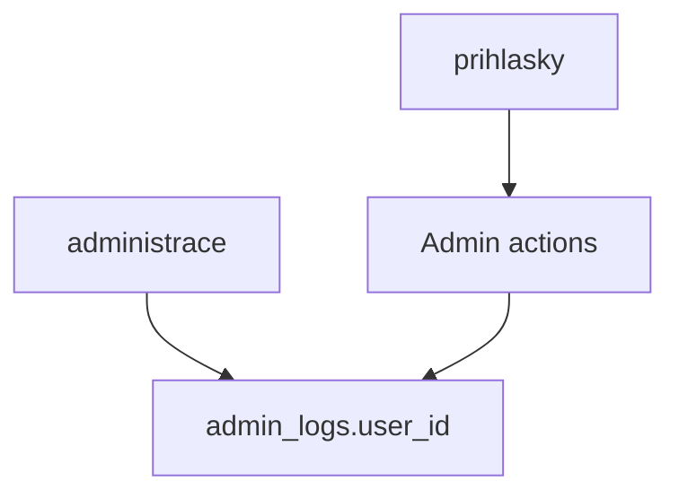

- `admin_logs.user_id` references admin accounts.
- Admin actions on `prihlasky` (such as deletions or payment updates) are logged in `admin_logs`.  
Sources: [administrace.sql](), [logs.sql](), [LOGGING_SYSTEM.md:39-53](), [AdminLogger.php]()

---

## Data Access Layer and Application Flows

### Registration Insertion: prihlaskaUploadToDB.php

`back/Database/prihlaskaUploadToDB.php` handles POST submissions from the race registration form and inserts a new row into `prihlasky`.  
Sources: [prihlaskaUploadToDB.php](), [front/prihlaska.php]()

Key responsibilities:

- Read POSTed form fields (`team`, `driver`, `car`, `category`, contact data, etc.).
- Validate required fields.
- Use `$conn` from `db.php` to perform an `INSERT` into `prihlasky`.
- On success, update application state (e.g., redirect or status message).

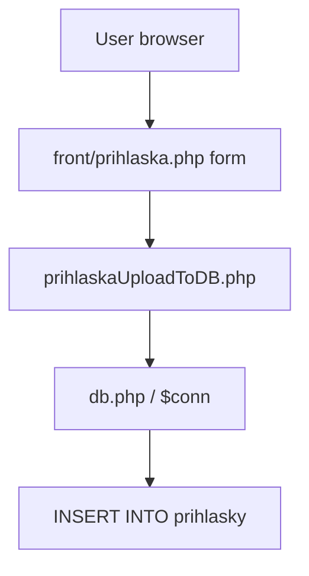

Sources: [front/prihlaska.php:30-60](), [prihlaskaUploadToDB.php](), [db.php]()

---

### Registration Retrieval: getPrihlasky.php and main pages

`back/Database/getPrihlasky.php` provides a backend endpoint for retrieving registrations from `prihlasky`.  
Sources: [getPrihlasky.php](), [prihlasky.sql]()

`front/main.php` and `front/main_backup.php` also query `prihlasky` directly after including `db.php`:

```php
@include './../back/Database/db.php';

$sql = "SELECT * FROM prihlasky ORDER BY datum_prihlaseni DESC LIMIT 10";
$result = $conn->query($sql);
```

Sources: [front/main.php:80-89]()

```php
@include './../back/Database/db.php';

$sql = "SELECT * FROM prihlasky ORDER BY datum_prihlaseni DESC";
$result = $conn->query($sql);
```

Sources: [front/main_backup.php:86-95]()

These queries populate `$registrace` arrays for display.  
Sources: [front/main.php:80-108](), [front/main_backup.php:86-120]()

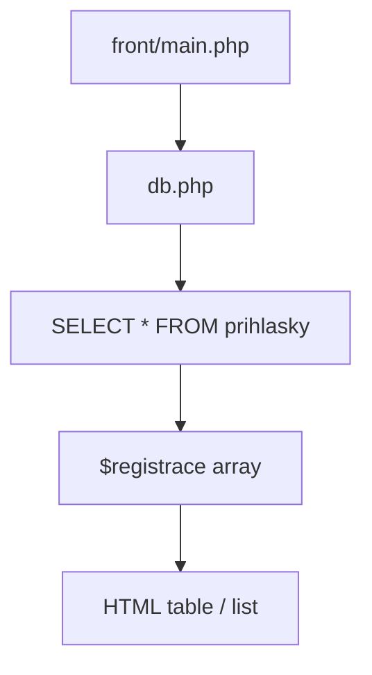

Sources: [front/main.php:80-108](), [db.php](), [prihlasky.sql]()

---

### Admin Logging: AdminLogger and view_logs.php

`back/Database/AdminLogger.php` encapsulates all logging operations into `admin_logs`.  
Sources: [AdminLogger.php](), [LOGGING_SYSTEM.md]()

Exposed methods:

| Method                                 | Description                                                     |
|----------------------------------------|-----------------------------------------------------------------|
| `log($action, $details, $status, $error_message)` | Inserts a new record into `admin_logs` with contextual data    |
| `getLogs($limit, $action)`             | Fetches recent log entries, optionally filtered by `action`    |
| `getUserLogs($user_id, $limit)`        | Returns recent logs for a specific admin user                  |

Sources: [AdminLogger.php](), [LOGGING_SYSTEM.md:23-37]()

Usage in `back/view_logs.php`:

```php
require_once './Database/db.php';
require_once './Database/AdminLogger.php';

$logger = new AdminLogger($conn, $_SESSION['user_id'], $_SESSION['username']);

$filter_action = isset($_GET['action']) ? $_GET['action'] : null;
$logs = $logger->getLogs(200, $filter_action);
```

Sources: [view_logs.php:1-17]()

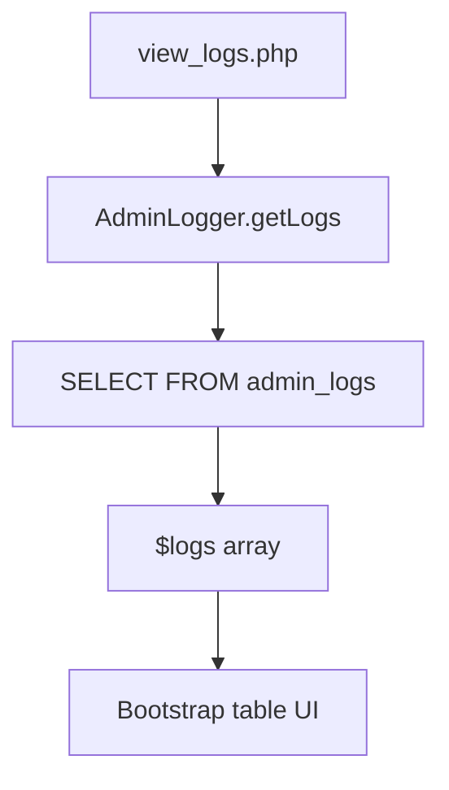

Sources: [AdminLogger.php](), [view_logs.php:1-60](), [logs.sql]()

---

## Non-SQL Data Stores

### race_date.txt — Race Date

The active race date is stored in the text file `front/race_date.txt`.  
Sources: [front/race_date.txt](), [front/main.php](), [front/main_backup.php]()

In `front/main.php`:

```php
$race_date = file_exists("race_date.txt") ? file_get_contents("race_date.txt") : "2025-01-01";
```

Sources: [front/main.php:54-57]()

`front/prihlaska.php` and `front/main_backup.php` similarly display this value, sometimes writeable from admin-only forms (backed by `back/update_date.php`, which is documented in the logging docs).  
Sources: [front/prihlaska.php:18-29](), [front/main_backup.php:1-25](), [LOGGING_SYSTEM.md:24-31]()

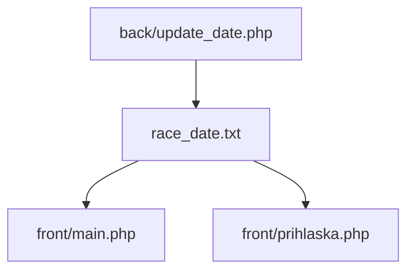

Sources: [front/main.php:54-57](), [front/prihlaska.php:18-29](), [front/main_backup.php:1-25](), [LOGGING_SYSTEM.md:24-31]()

---

### registrace.json — Cached Registration Data

`front/registrace.json` is a JSON file with registration data, used as a simple static or cached representation of registrations.  
Sources: [front/registrace.json](), [front/main.php]()

While `front/main.php` currently fetches registrations directly from the database, this file can represent historical or backup data. Its structure is JSON, likely an array of objects mirroring the `prihlasky` fields.  
Sources: [front/registrace.json](), [prihlasky.sql]()

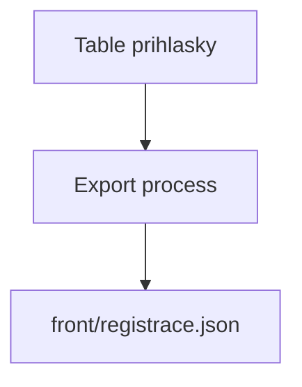

Sources: [front/registrace.json](), [prihlasky.sql]()

---

## Logging Data Model in Detail

### Logged Actions and Semantics

From `LOGGING_SYSTEM.md`, the following actions are recorded:  
Sources: [LOGGING_SYSTEM.md:39-53]()

| Action name              | Description                                           | Typical data affected                    |
|--------------------------|-------------------------------------------------------|------------------------------------------|
| `LOGIN`                  | Successful login                                      | `administrace` (via user_id)             |
| `LOGIN_FAILED`           | Failed login with reason                              | N/A (authentication only)                |
| `LOGOUT`                 | User logout                                           | Session only                             |
| `CAROUSEL_UPDATE`        | Carousel image updates                                | Files in front-end                       |
| `RACE_DATE_UPDATE`       | Change of `race_date.txt`                             | `race_date.txt`                          |
| `REGISTRATION_DELETE`    | Deletion of a row from `prihlasky`                    | `prihlasky`                              |
| `PAYMENT_STATUS_UPDATE`  | Change of `zaplaceno` status in `prihlasky`           | `prihlasky.zaplaceno`                    |
| `VIEW_LOGS`              | Access to `back/view_logs.php`                        | `admin_logs`                             |

Sources: [LOGGING_SYSTEM.md:39-53](), [view_logs.php:10-15]()

`back/view_logs.php` uses an `$actions_list` that corresponds to this list:

```php
$actions_list = array(
  'LOGIN',
  'LOGOUT',
  'CAROUSEL_UPDATE',
  'RACE_DATE_UPDATE',
  'REGISTRATION_DELETE',
  'PAYMENT_STATUS_UPDATE',
  'LOGIN_FAILED',
  'VIEW_LOGS'
);
```

Sources: [view_logs.php:10-15]()

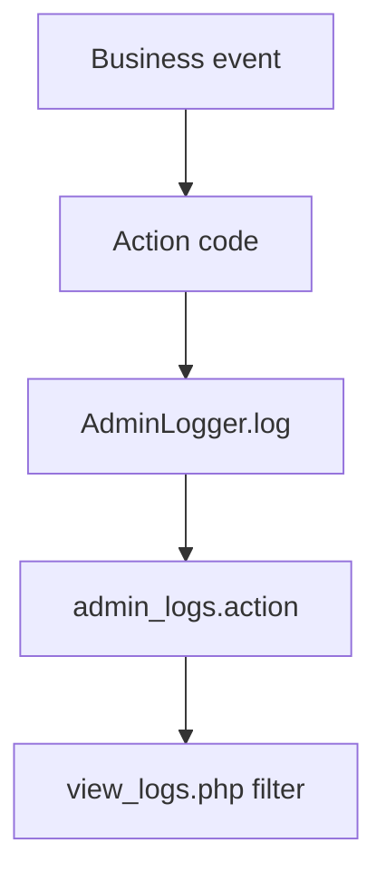

Sources: [AdminLogger.php](), [LOGGING_SYSTEM.md:39-53](), [view_logs.php:10-32]()

---

## Sequence Example: Registration and Logging (Conceptual)

While logging for registration insertions is not explicitly shown, many admin operations on registrations (delete, payment update) are logged. Below is a conceptual sequence for an admin deleting a registration and the logging that follows.

```mermaid
sequenceDiagram
  autonumber
  actor A as Admin
  participant B as front/main.php
  participant C as back/delete_prihlaska.php
  database D as DB prihlasky
  entity E as AdminLogger
  database F as DB admin_logs

  A->>+B: Click delete
  B->>+C: POST registration ID
  C->>+D: DELETE FROM prihlasky
  D-->>-C: Deletion OK
  C->>+E: log("REGISTRATION_DELETE", details, "success", "")
  E->>+F: INSERT INTO admin_logs
  F-->>-E: Insert OK
  E-->>-C: Log OK
  C-->>-B: Redirect / success message
  B-->>-A: Updated registrations
```

Sources: [LOGGING_SYSTEM.md:31-37,39-53](), [AdminLogger.php](), [prihlasky.sql]()

---

## Summary

The ASK Hořovice web application uses a compact but clear data model:

- `administrace` stores admin users, which are the principals for all authenticated operations.
- `prihlasky` stores race registrations, which are read by public pages and manipulated by admins.
- `admin_logs` records all sensitive admin operations with detailed metadata, enabling an auditable history.
- Supporting files (`race_date.txt`, `registrace.json`) hold auxiliary configuration and cached registration data.
- PHP scripts (`db.php`, `prihlaskaUploadToDB.php`, `getPrihlasky.php`, `AdminLogger.php`, `view_logs.php`) form a thin data access layer coupling these data structures to the UI.

This schema and its associated code provide a straightforward foundation for managing race registrations and monitoring administrative activity within the application.  
Sources: [administrace.sql](), [prihlasky.sql](), [logs.sql](), [db.php](), [prihlaskaUploadToDB.php](), [getPrihlasky.php](), [AdminLogger.php](), [view_logs.php](), [front/main.php](), [front/main_backup.php](), [LOGGING_SYSTEM.md](), [SECURITY_ENV_SETUP.md](), [race_date.txt](), [registrace.json]()

---

<a id="page-4"></a>

## Admin Panel, Logging System, and Workflows

**Related Files**:
- `back/login.php`
- `back/logout.php`
- `back/register.php`
- `back/update.php`
- `back/delete_prihlaska.php`
- `back/updateZaplaceno.php`
- `back/update_date.php`
- `back/update_carousel.php`
- `back/view_logs.php`
- `back/Database/AdminLogger.php`
- `back/LOGGING_SYSTEM.md`
- `front/Login.php`
- `front/Login_backup.php`
- `front/main.php`
- `front/main_backup.php`

**Related Pages**:
- [Overview and Project Structure](#page-1)
- [Data Model and Database Schema](#page-3)
- [Front-end UI, Content Management, and File Handling](#page-5)

<details>
<summary>Relevant source files</summary>

The following files were used as context for generating this wiki page:

- [back/LOGGING_SYSTEM.md](https://github.com/Mir04ange/ASZhoroviceWebphp/blob/main/back/LOGGING_SYSTEM.md)
- [back/view_logs.php](https://github.com/Mir04ange/ASZhoroviceWebphp/blob/main/back/view_logs.php)
- [back/Database/AdminLogger.php](https://github.com/Mir04ange/ASZhoroviceWebphp/blob/main/back/Database/AdminLogger.php)
- [back/login.php](https://github.com/Mir04ange/ASZhoroviceWebphp/blob/main/back/login.php)
- [back/logout.php](https://github.com/Mir04ange/ASZhoroviceWebphp/blob/main/back/logout.php)
- [back/update_carousel.php](https://github.com/Mir04ange/ASZhoroviceWebphp/blob/main/back/update_carousel.php)
- [back/update_date.php](https://github.com/Mir04ange/ASZhoroviceWebphp/blob/main/back/update_date.php)
- [back/delete_prihlaska.php](https://github.com/Mir04ange/ASZhoroviceWebphp/blob/main/back/delete_prihlaska.php)
- [back/updateZaplaceno.php](https://github.com/Mir04ange/ASZhoroviceWebphp/blob/main/back/updateZaplaceno.php)
- [front/main.php](https://github.com/Mir04ange/ASZhoroviceWebphp/blob/main/front/main.php)
- [front/main_backup.php](https://github.com/Mir04ange/ASZhoroviceWebphp/blob/main/front/main_backup.php)
- [front/poradatele.php](https://github.com/Mir04ange/ASZhoroviceWebphp/blob/main/front/poradatele.php)
- [front/css/backLogsStyle.css](https://github.com/Mir04ange/ASZhoroviceWebphp/blob/main/front/css/backLogsStyle.css)
</details>

# Admin Panel, Logging System, and Workflows

## Introduction  
Sources: [back/LOGGING_SYSTEM.md]()  

The project implements an admin panel and a centralized logging system that records all critical administrative actions such as authentication events, content updates, registration management, and access to log views. Logs are persisted in a dedicated `admin_logs` database table via the `AdminLogger` class and surfaced to administrators through a protected UI at `/back/view_logs.php`.  
Sources: [back/LOGGING_SYSTEM.md:1-54](), [back/view_logs.php:1-40]()

The admin panel itself is embedded into the main site UI and is conditionally available based on the logged-in user’s role. From this panel, admins can manage carousel images, race dates, registrations, and payment statuses; each of these operations is integrated with the logging system to maintain an auditable trail of activity.  
Sources: [front/main.php](), [front/main_backup.php:1-60](), [back/update_carousel.php](), [back/update_date.php](), [back/delete_prihlaska.php](), [back/updateZaplaceno.php]()

---

## Architecture Overview

### High-Level Components  
Sources: [back/LOGGING_SYSTEM.md](), [back/Database/AdminLogger.php](), [back/view_logs.php]()  

Key components involved in the admin and logging workflows:

| Component / File                    | Responsibility                                                                                                        |
|------------------------------------|------------------------------------------------------------------------------------------------------------------------|
| `back/Database/AdminLogger.php`    | Logger class encapsulating all logging operations, including writing and retrieving log entries.                      |
| `admin_logs` DB table              | Stores structured audit trail of admin activities (action, details, IP, user agent, status, error).                   |
| `back/LOGGING_SYSTEM.md`          | Design document describing schema, logged actions, and integration points.                                             |
| `back/view_logs.php`              | Admin-only UI to browse and filter logs by action type.                                                                |
| `back/login.php`                  | Handles admin login; logs success and failure attempts.                                                                |
| `back/logout.php`                 | Handles admin logout; logs logout action.                                                                              |
| `back/update_carousel.php`        | Processes carousel image updates; logs update events with image-count details.                                         |
| `back/update_date.php`            | Manages race date changes; logs successful updates and validation failures.                                            |
| `back/delete_prihlaska.php`       | Deletes registrations; logs which registration (team name and ID) was removed.                                        |
| `back/updateZaplaceno.php`        | Updates payment status; logs changes with team name.                                                                   |
| `front/main.php` / backup         | Frontend that exposes admin-only controls and a navigation link to the logs view.                                     |

Sources: [back/LOGGING_SYSTEM.md:1-54](), [back/view_logs.php:1-40](), [front/main.php](), [front/main_backup.php:61-115]()

### System Interaction Diagram  

The following diagram shows how admin actions flow through the system into the logging infrastructure and back to the logs UI.

```mermaid
graph TD
  A["Admin user"] --> B["Front-end admin UI"]
  B["Front-end admin UI"] --> C["Back-end handlers (login/update/etc.)"]
  C["Back-end handlers (login/update/etc.)"] --> D["AdminLogger class"]
  D["AdminLogger class"] --> E["admin_logs table"]
  A["Admin user"] --> F["View logs UI (/back/view_logs.php)"]
  F["View logs UI (/back/view_logs.php)"] --> D["AdminLogger class"]
  D["AdminLogger class"] --> F["View logs UI (/back/view_logs.php)"]
```

Sources: [back/LOGGING_SYSTEM.md:1-54](), [back/Database/AdminLogger.php](), [back/view_logs.php:1-40](), [front/main.php](), [front/main_backup.php:61-115]()

---

## Data Model: `admin_logs` Table  
Sources: [back/LOGGING_SYSTEM.md:6-29]()  

The logging system is backed by a single table, `admin_logs`, which stores normalized audit events.

### Schema Fields

| Column         | Description                                                                                   |
|----------------|-----------------------------------------------------------------------------------------------|
| `id_log`       | Auto-increment primary key for each log entry.                                               |
| `user_id`      | Foreign key to the `loginsystem` user table identifying the admin performing the action.     |
| `username`     | Username of the admin at the time of the action.                                            |
| `action`       | High-level action code such as `LOGIN`, `LOGOUT`, `CAROUSEL_UPDATE`, etc.                    |
| `action_details` | Free-text description capturing contextual details of what was done.                      |
| `ip_address`   | IP address of the admin’s client.                                                             |
| `user_agent`   | Browser/client user-agent string.                                                             |
| `timestamp`    | When the action occurred; automatically set to current time.                                  |
| `status`       | Outcome of the operation, e.g. `success` or `failed`.                                         |
| `error_message`| Optional error description if the operation failed or encountered issues.                    |

Sources: [back/LOGGING_SYSTEM.md:6-29]()

### ER Diagram (Simplified)

```mermaid
graph TD
  A["loginsystem table"] --> B["admin_logs table"]
  B["admin_logs table"] --> C["id_log (PK)"]
  B["admin_logs table"] --> D["user_id (FK)"]
  B["admin_logs table"] --> E["username"]
  B["admin_logs table"] --> F["action"]
  B["admin_logs table"] --> G["action_details"]
  B["admin_logs table"] --> H["ip_address"]
  B["admin_logs table"] --> I["user_agent"]
  B["admin_logs table"] --> J["timestamp"]
  B["admin_logs table"] --> K["status"]
  B["admin_logs table"] --> L["error_message"]
```

Sources: [back/LOGGING_SYSTEM.md:6-29]()

---

## AdminLogger Class

### Responsibilities and Methods  
Sources: [back/Database/AdminLogger.php](), [back/LOGGING_SYSTEM.md:30-51]()  

The `AdminLogger` class centralizes all logging-related behavior and is used across multiple backend handlers.

Declared methods:

| Method                               | Purpose                                                                                                       |
|--------------------------------------|---------------------------------------------------------------------------------------------------------------|
| `log($action, $details, $status, $error_message)` | Inserts a new log entry into `admin_logs` with contextual metadata (action, details, status, error).        |
| `getLogs($limit, $action)`          | Retrieves recent log entries, optionally filtered by `action` type and limited by `limit`.                   |
| `getUserLogs($user_id, $limit)`     | Fetches log entries associated with a specific user ID.                                                       |

Sources: [back/LOGGING_SYSTEM.md:30-42](), [back/Database/AdminLogger.php]()

### Class Diagram

```mermaid
graph TD
  A["AdminLogger"] --> B["log(action, details, status, error_message)"]
  A["AdminLogger"] --> C["getLogs(limit, action)"]
  A["AdminLogger"] --> D["getUserLogs(user_id, limit)"]
  A["AdminLogger"] --> E["DB connection ($conn)"]
  A["AdminLogger"] --> F["Session user_id"]
  A["AdminLogger"] --> G["Session username"]
```

Sources: [back/Database/AdminLogger.php](), [back/view_logs.php:7-13]()

### Typical Usage

A typical instantiation pattern (for example in `view_logs.php`) creates an `AdminLogger` using the active DB connection and current session user identity:

```php
require_once './Database/db.php';
require_once './Database/AdminLogger.php';

$logger = new AdminLogger($conn, $_SESSION['user_id'], $_SESSION['username']);
```

Sources: [back/view_logs.php:9-13]()

This instance is then used to retrieve logs:

```php
$filter_action = isset($_GET['action']) ? $_GET['action'] : null;
$logs = $logger->getLogs(200, $filter_action);
```

Sources: [back/view_logs.php:15-16]()

---

## Logged Actions and Workflows

### Catalog of Logged Actions  
Sources: [back/LOGGING_SYSTEM.md:54-71]()  

The following action codes are defined and referenced throughout the system:

| Action Code              | Description                                                                            |
|--------------------------|----------------------------------------------------------------------------------------|
| `LOGIN`                  | Successful user login.                                                                |
| `LOGIN_FAILED`           | Failed login attempt, with reason.                                                   |
| `LOGOUT`                 | User logout.                                                                          |
| `CAROUSEL_UPDATE`        | Carousel image uploads or updates.                                                   |
| `RACE_DATE_UPDATE`       | Race date changes.                                                                    |
| `REGISTRATION_DELETE`    | Deletion of race registrations.                                                       |
| `PAYMENT_STATUS_UPDATE`  | Changes to registration payment status.                                              |
| `VIEW_LOGS`              | Access to the logs viewing page.                                                     |

Sources: [back/LOGGING_SYSTEM.md:54-71]()

`view_logs.php` keeps a list of these actions to drive UI filtering:

```php
$actions_list = array(
    'LOGIN',
    'LOGOUT',
    'CAROUSEL_UPDATE',
    'RACE_DATE_UPDATE',
    'REGISTRATION_DELETE',
    'PAYMENT_STATUS_UPDATE',
    'LOGIN_FAILED',
    'VIEW_LOGS'
);
```

Sources: [back/view_logs.php:17-20]()

---

## Admin Authentication and Session Handling

### Login Workflow  
Sources: [back/login.php](), [back/LOGGING_SYSTEM.md:54-60](), [front/main.php](), [front/main_backup.php]()

The login backend (`back/login.php`) processes credentials and, on success, sets session attributes such as `$_SESSION['username']`, `$_SESSION['user_id']`, and `$_SESSION['role']`. Successful and failed attempts are logged with appropriate action codes and statuses, as specified by the logging document.  
Sources: [back/login.php](), [back/LOGGING_SYSTEM.md:54-60]()

On success, an entry is written with:

- `action = "LOGIN"`
- `status = "success"`
- descriptive `action_details` (e.g., which user logged in)
- captured `ip_address` and `user_agent`

On failure, an entry is written with:

- `action = "LOGIN_FAILED"`
- `status = "failed"`
- `error_message` containing the reason  
Sources: [back/LOGGING_SYSTEM.md:54-60](), [back/login.php]()

### Logout Workflow  
Sources: [back/logout.php](), [back/LOGGING_SYSTEM.md:61-62]()

`back/logout.php` handles user logout, clearing the session and logging the operation:

- `action = "LOGOUT"`
- `status = "success"`
- `action_details` describing the logout event  
Sources: [back/logout.php](), [back/LOGGING_SYSTEM.md:61-62]()

### Authentication Sequence Diagram

```mermaid
sequenceDiagram
  autonumber
  participant U as actor User
  participant F as boundary Front-end (login form)
  participant L as control login.php
  participant G as control AdminLogger
  participant D as database admin_logs

  U->>+F: Submit credentials
  F->>+L: POST /back/login.php
  alt Valid credentials
    L->>+G: log("LOGIN", details, "success", "")
    G->>+D: INSERT log row
    D-->>-G: OK
    G-->>-L: Logged
    L-->>-F: Login success
  else Invalid credentials
    L->>+G: log("LOGIN_FAILED", reason, "failed", error)
    G->>+D: INSERT log row
    D-->>-G: OK
    G-->>-L: Logged
    L-->>-F: Login failed
  end
  F-->>-U: Show result
```

Sources: [back/login.php](), [back/Database/AdminLogger.php](), [back/LOGGING_SYSTEM.md:54-60]()

---

## Admin Panel Integration in Frontend

### Admin Panel Entry Points in `front/main.php`  
Sources: [front/main.php]()

The main front-end page conditionally renders admin-only features based on the `$_SESSION['role']` variable.

Key checks:

```php
<?php if(isset($_SESSION['role']) && $_SESSION['role'] == 'admin'): ?>
<div class="section-container" style="background: rgba(230, 57, 70, 0.05); border-top: 1px solid rgba(230, 57, 70, 0.2);">
    <div class="content-wrapper">
        <h3 class="text-primary mb-4">Správa obsahu</h3>
        
        <div class="row g-4">
            <div class="col-lg-6">
                <div class="card-premium">
                    <h4 class="text-primary mb-3">Upravit Carousel</h4>
                    <form action="update_carousel.php" method="POST" enctype="multipart/form-data">
                        <?php for($i=1; $i<=5; $i++): ?>
                            <div class="form-group">
                                <label class="form-label">Obrázek <?= $i ?></label>
                                <input type="file" name="carousel_img<?= $i ?>" accept="image/*" class="form-control">
```

Sources: [front/main.php]()

The navigation bar exposes a link to the logs view only for admins:

```php
<?php if(isset($_SESSION['role']) && $_SESSION['role'] == 'admin'): ?>
    <li class="nav-item"><a class="nav-link" href="../back/view_logs.php">Logy</a></li>
<?php endif; ?>
```

Sources: [front/main.php]()

Similarly, `front/poradatele.php` repeats the admin-only link to the logs page:

```php
<?php if(isset($_SESSION['role']) && $_SESSION['role'] == 'admin'): ?>
    <li class="nav-item active-element"><a class="nav-link text-white" href="../back/view_logs.php">Logy</a></li>
<?php endif; ?>
```

Sources: [front/poradatele.php]()

### Admin Panel Features (Frontend)

Within `front/main.php`, the admin content management section currently includes:

- Carousel update form (`action="update_carousel.php"`).
- Race date management (in main or `main_backup.php`).
- Conditional links to organizer tools and log views.  
Sources: [front/main.php](), [front/main_backup.php:61-115]()

The `main_backup.php` file holds an earlier, simpler admin block:

```php
<?php if(isset($_SESSION['role']) && $_SESSION['role'] == 'admin'): ?>
<div class="container mt-4">
    <h5>Upravit Carousel</h5>
    <form action="update_carousel.php" method="POST" enctype="multipart/form-data">
    <?php for($i=1; $i<=5; $i++): ?>
      <label class="CarouselImgText">Obrázek <?= $i ?>:</label>
      <input type="file" name="carousel_img<?= $i ?>" accept="image/*" class="form-control mb-2">
      <input type="text" name="carousel_url<?= $i ?>" placeholder="nebo vložte URL obrázku" class="form-control mb-2">
    <?php endfor; ?>
        <button type="submit" class="btn btn-primary">Uložit obrázky</button>
    </form>
```

Sources: [front/main_backup.php:61-79]()

---

## Log Viewer: `back/view_logs.php`

### Access Control and Initialization  
Sources: [back/view_logs.php:1-16]()

`view_logs.php` enforces strict role-based access: only users with `$_SESSION['role'] === 'admin'` can access the log viewer.

```php
session_start();

if (!isset($_SESSION['role']) || $_SESSION['role'] !== 'admin') {
    die('Přístup zamítnut. Pouze administrátoři mohou vidět logy.');
}

require_once './Database/db.php';
require_once './Database/AdminLogger.php';

$logger = new AdminLogger($conn, $_SESSION['user_id'], $_SESSION['username']);

$filter_action = isset($_GET['action']) ? $_GET['action'] : null;
$logs = $logger->getLogs(200, $filter_action);
```

Sources: [back/view_logs.php:1-16]()

### Filtering UI  
Sources: [back/view_logs.php:17-38](), [front/css/backLogsStyle.css]()

The page defines a fixed list of actions for filtering:

```php
$actions_list = array(
    'LOGIN',
    'LOGOUT',
    'CAROUSEL_UPDATE',
    'RACE_DATE_UPDATE',
    'REGISTRATION_DELETE',
    'PAYMENT_STATUS_UPDATE',
    'LOGIN_FAILED',
    'VIEW_LOGS'
);
```

Sources: [back/view_logs.php:17-20]()

The corresponding UI uses Bootstrap-styled buttons to filter logs by action:

```php
<div class="filter-section text-white">
    <h5>Filtrovat podle akce:</h5>
    <div class="btn-group mb-3 " role="group">
        <a href="?action=" class="btn btn-outline-light prettier <?php echo $filter_action === null ? 'active' : ''; ?>">Vše</a>
        <?php foreach ($actions_list as $act): ?>
            <a href="?action=<?php echo urlencode($act); ?>" class="btn btn-outline-light <?php echo $filter_action === $act ? 'active' : ''; ?>">
                <?php echo $act; ?>
            </a>
        <?php endforeach; ?>
    </div>
</div>
```

Sources: [back/view_logs.php:25-36]()

CSS rules in `front/css/backLogsStyle.css` style this page, including alignment and responsiveness for the filter buttons:

```css
.filter-section .btn-group {
    display: inline-flex;
    justify-content: center;
    align-items: center;
    flex-wrap: wrap;
    gap: 6px;
}

/* Ensure buttons don't stretch too wide on small screens */
.filter-section .btn-group .btn {
    white-space: nowrap;
}
```

Sources: [front/css/backLogsStyle.css:1-18]()

### Logs Retrieval Flow Diagram

```mermaid
graph TD
  A["Admin visits /back/view_logs.php"] --> B["Session role check (admin)"]
  B["Session role check (admin)"] --> C["Instantiate AdminLogger"]
  C["Instantiate AdminLogger"] --> D["Read ?action filter"]
  D["Read ?action filter"] --> E["AdminLogger.getLogs(200, action)"]
  E["AdminLogger.getLogs(200, action)"] --> F["Query admin_logs table"]
  F["Query admin_logs table"] --> G["Render logs table (HTML)"]
  G["Render logs table (HTML)"] --> H["Admin filters again via buttons"]
  H["Admin filters again via buttons"] --> D["Read ?action filter"]
```

Sources: [back/view_logs.php:1-40](), [back/Database/AdminLogger.php]()

---

## Content Management Workflows

### Carousel Update Workflow  
Sources: [back/update_carousel.php](), [front/main.php](), [front/main_backup.php:61-79](), [back/LOGGING_SYSTEM.md:62-64]()

Admins can upload or adjust carousel images via forms in `front/main.php` and `front/main_backup.php`. These forms target `back/update_carousel.php`.

- The admin panel form uses file inputs `carousel_img1`–`carousel_img5`.  
  Sources: [front/main.php](), [front/main_backup.php:61-79]()

- `update_carousel.php` processes uploaded images, persists changes, and logs a `CAROUSEL_UPDATE` action with details such as the number of images changed.  
  Sources: [back/update_carousel.php](), [back/LOGGING_SYSTEM.md:62-64]()

Logged fields include:

- `action = "CAROUSEL_UPDATE"`
- `action_details` describing how many and which images were updated
- `status` (`success` or `failed`)
- `error_message` if upload/storage fails  
Sources: [back/LOGGING_SYSTEM.md:62-64](), [back/update_carousel.php]()

### Race Date Update Workflow  
Sources: [back/update_date.php](), [front/main_backup.php:80-102](), [back/LOGGING_SYSTEM.md:64-67]()

The race date is administered through a form in the admin section:

```php
<h5 class="mt-4 ">Upravit datum závodu</h5>
<form action="../back/update_date.php" method="POST">
  <input type="date" name="race_date" class="form-control" value="<?= $race_date ?>" required>
  <button type="submit" class="btn btn-primary mt-2">Uložit datum</button>
</form>
```

Sources: [front/main_backup.php:80-87]()

`back/update_date.php` updates the date in the database. Logging behavior includes:

- On success: `RACE_DATE_UPDATE` with new date in `action_details` and `status = "success"`.
- On validation failure: `RACE_DATE_UPDATE` with `status = "failed"` and appropriate `error_message`.  
Sources: [back/update_date.php](), [back/LOGGING_SYSTEM.md:64-67]()

### Registration Deletion Workflow  
Sources: [back/delete_prihlaska.php](), [back/LOGGING_SYSTEM.md:67-69]()

`back/delete_prihlaska.php` removes a registration entry based on an ID. The logger is invoked to record:

- `action = "REGISTRATION_DELETE"`
- `action_details` including team name and registration ID
- `status` for the delete operation  
Sources: [back/delete_prihlaska.php](), [back/LOGGING_SYSTEM.md:67-69]()

### Payment Status Update Workflow  
Sources: [back/updateZaplaceno.php](), [back/LOGGING_SYSTEM.md:69-71]()

`back/updateZaplaceno.php` changes the payment status for a registration. The logging system records:

- `action = "PAYMENT_STATUS_UPDATE"`
- `action_details` including team name and new payment status
- `status` indicating the result of the update  
Sources: [back/updateZaplaceno.php](), [back/LOGGING_SYSTEM.md:69-71]()

### Content Management Flow Diagram

```mermaid
graph TD
  A["Admin in main.php"] --> B["Submit carousel / date / registration form"]
  B["Submit carousel / date / registration form"] --> C["Back-end handler (update_carousel / update_date / delete_prihlaska / updateZaplaceno)"]
  C["Back-end handler (update_carousel / update_date / delete_prihlaska / updateZaplaceno)"] --> D["Perform DB changes"]
  D["Perform DB changes"] --> E["AdminLogger.log(action, details, status, error)"]
  E["AdminLogger.log(action, details, status, error)"] --> F["admin_logs table"]
  D["Perform DB changes"] --> G["Return success or failure"]
  G["Return success or failure"] --> H["Admin UI feedback"]
```

Sources: [front/main.php](), [front/main_backup.php:61-102](), [back/update_carousel.php](), [back/update_date.php](), [back/delete_prihlaska.php](), [back/updateZaplaceno.php](), [back/Database/AdminLogger.php](), [back/LOGGING_SYSTEM.md:62-71]()

---

## Logs Access, Security, and Styling

### Accessing Logs  
Sources: [back/LOGGING_SYSTEM.md:73-87](), [back/view_logs.php:1-16]()

The official entry point to view logs is:

- URL: `/back/view_logs.php`

Characteristics:

- Access is restricted to admins by checking `$_SESSION['role']`.
- Access to the logs page itself is also logged as `VIEW_LOGS`.  
- Logs can be filtered by action type using the `?action=` query parameter.  
Sources: [back/LOGGING_SYSTEM.md:73-87](), [back/view_logs.php:1-20]()

### Security Features in the Logging System  
Sources: [back/LOGGING_SYSTEM.md:89-105]()

The logging system’s design highlights:

- IP address tracking (`ip_address` field).
- User agent tracking (`user_agent` field).
- Role-based access control enforced in `view_logs.php`.
- Detailed error message recording for failed operations.
- Timestamps on all log entries.
- Foreign key constraint from `admin_logs.user_id` to the `loginsystem` user table.
- Indexing for faster queries on logs.  

Sources: [back/LOGGING_SYSTEM.md:89-105](), [back/view_logs.php:1-16]()

### Styling

`front/css/backLogsStyle.css` provides styling for:

- Centered filter button group.
- Non-wrapping buttons.
- A monospace `.prettier` button style.
- Navbar alignment on the logs page.  

Example:

```css
.prettier {
    font-family: 'Courier New', Courier, monospace;
    text-decoration: none;
    text-underline-offset: none;
    border: 1px solid white;
    color: white;
    padding: 5px 10px;
    border-radius: 5px;
}
```

Sources: [front/css/backLogsStyle.css:19-31]()

---

## Summary

The admin panel and logging system collectively provide a controlled environment for managing content, race metadata, registrations, and payments, while maintaining a detailed and queryable audit trail. Access to administrative capabilities is guarded by session-based role checks in the front-end and back-end, and every key operation is recorded in the `admin_logs` table through the `AdminLogger` class. Logs can be reviewed and filtered via a dedicated admin-only UI, strengthening operational transparency and security across the application.  
Sources: [back/LOGGING_SYSTEM.md](), [back/Database/AdminLogger.php](), [back/view_logs.php](), [back/login.php](), [back/logout.php](), [back/update_carousel.php](), [back/update_date.php](), [back/delete_prihlaska.php](), [back/updateZaplaceno.php](), [front/main.php](), [front/main_backup.php](), [front/poradatele.php](), [front/css/backLogsStyle.css]()

---

<a id="page-5"></a>

## Front-end UI, Content Management, and File Handling

**Related Files**:
- `front/main.php`
- `front/main_backup.php`
- `front/prihlaska.php`
- `front/prihlaska_backup.php`
- `front/poradatele.php`
- `front/download_pdf.php`
- `front/update_carousel.php`
- `front/carousel_images.json`
- `front/css/premium-design.css`
- `front/css/main.css`
- `front/css/Carousel.css`
- `front/css/prihlaska.css`
- `front/css/login.css`
- `front/css/navbars.css`
- `front/css/btn.css`
- `front/css/mujtext.css`
- `front/css/backLogsStyle.css`
- `front/css/animation.css`
- `front/scss/animations.scss`
- `front/scss/footer.scss`
- `front/scss/index.scss`
- `front/js/main.js`
- `front/js/cursor.js`
- `front/pdfs/Oznameni_do_obci_editovatelne.docx`
- `front/pdfs/Pokyny_pro_poradatele.docx`
- `front/pdfs/Skoleni_poradatelu.docx`
- `front/pdfs/Upozorneni_auta_stojici_na_RZ_editovatelne.docx`
- `front/img/image0 (1).png`
- `SVGLOGA/sadasdsd.svg`
- `SVGLOGA/JOP.svg`

**Related Pages**:
- [Overview and Project Structure](#page-1)
- [Environment Setup and Security](#page-2)
- [Admin Panel, Logging System, and Workflows](#page-4)

<details>
<summary>Relevant source files</summary>

The following files were used as context for generating this wiki page:

- [front/main.php](https://github.com/Mir04ange/ASZhoroviceWebphp/blob/main/front/main.php)
- [front/main_backup.php](https://github.com/Mir04ange/ASZhoroviceWebphp/blob/main/front/main_backup.php)
- [front/prihlaska.php](https://github.com/Mir04ange/ASZhoroviceWebphp/blob/main/front/prihlaska.php)
- [front/poradatele.php](https://github.com/Mir04ange/ASZhoroviceWebphp/blob/main/front/poradatele.php)
- [front/css/premium-design.css](https://github.com/Mir04ange/ASZhoroviceWebphp/blob/main/front/css/premium-design.css)
- [front/css/main.css](https://github.com/Mir04ange/ASZhoroviceWebphp/blob/main/front/css/main.css)
- [front/css/Carousel.css](https://github.com/Mir04ange/ASZhoroviceWebphp/blob/main/front/css/Carousel.css)
- [front/css/prihlaska.css](https://github.com/Mir04ange/ASZhoroviceWebphp/blob/main/front/css/prihlaska.css)
- [front/css/login.css](https://github.com/Mir04ange/ASZhoroviceWebphp/blob/main/front/css/login.css)
- [front/css/navbars.css](https://github.com/Mir04ange/ASZhoroviceWebphp/blob/main/front/css/navbars.css)
- [front/css/btn.css](https://github.com/Mir04ange/ASZhoroviceWebphp/blob/main/front/css/btn.css)
- [front/css/mujtext.css](https://github.com/Mir04ange/ASZhoroviceWebphp/blob/main/front/css/mujtext.css)
- [front/css/backLogsStyle.css](https://github.com/Mir04ange/ASZhoroviceWebphp/blob/main/front/css/backLogsStyle.css)
- [front/js/main.js](https://github.com/Mir04ange/ASZhoroviceWebphp/blob/main/front/js/main.js)
- [front/js/cursor.js](https://github.com/Mir04ange/ASZhoroviceWebphp/blob/main/front/js/cursor.js)
- [front/carousel_images.json](https://github.com/Mir04ange/ASZhoroviceWebphp/blob/main/front/carousel_images.json)
- [SVGLOGA/sadasdsd.svg](https://github.com/Mir04ange/ASZhoroviceWebphp/blob/main/SVGLOGA/sadasdsd.svg)

</details>

# Front-end UI, Content Management, and File Handling

## Introduction

The front-end of the ASK Hořovice web application provides the public race landing page, registration form, downloadable documents for organizers, and a lightweight content management surface for administrators. It is implemented with PHP-rendered HTML, Bootstrap-based layouts, and a custom premium design system. Dynamic content such as the race date, carousel images, and registrations are loaded from server-side resources and surfaced through these pages.  
Sources: [front/main.php](), [front/main_backup.php](), [front/prihlaska.php](), [front/poradatele.php](), [front/css/premium-design.css]()

This page documents the structure and behavior of the front-end UI, how content is managed (especially the carousel and race date), and how file handling is implemented for document downloads. It focuses on the PHP front-controllers, CSS layout, and JavaScript interactions defined in the referenced files.  
Sources: [front/css/main.css](), [front/css/Carousel.css](), [front/js/main.js](), [front/js/cursor.js]()

---

## High-level Architecture

The front-end is composed of PHP entry files that assemble HTML, CSS, and JS assets, and integrate with back-end storage via lightweight file and database access.

```mermaid
graph TD
  A["User browser"]
  B["front/main.php"]
  C["front/prihlaska.php"]
  D["front/poradatele.php"]
  E["carousel_images.json"]
  F["race_date.txt"]
  G["DB: prihlasky"]
  H["CSS & JS assets"]

  A-->B
  A-->C
  A-->D

  B-->E
  B-->F
  B-->G
  B-->H

  C-->F
  C-->H

  D-->H
```

This diagram shows how each front controller interacts with local files, the database, and shared assets.  
Sources: [front/main.php](), [front/main_backup.php](), [front/prihlaska.php](), [front/poradatele.php](), [front/css/premium-design.css](), [front/css/main.css](), [front/carousel_images.json]()

### Key Front-end Components

| Component              | Responsibility                                                  | Primary Files                                                                 |
|------------------------|----------------------------------------------------------------|------------------------------------------------------------------------------|
| Landing page           | Public homepage, carousel, race info, registrations listing   | `front/main.php`, `front/main_backup.php`                                    |
| Registration form      | Race registration UI                                          | `front/prihlaska.php`                                                        |
| Organizers downloads   | Auth-protected document downloads for organizers              | `front/poradatele.php`                                                       |
| Design system / layout | Global typography, layout, sections, utilities, navbar        | `front/css/premium-design.css`, `front/css/main.css`, `front/css/navbars.css` |
| Carousel styling       | Carousel layout & controls                                    | `front/css/Carousel.css`                                                     |
| Registration styling   | Registration form look & layout                               | `front/css/prihlaska.css`                                                    |
| Buttons & text         | Custom buttons, typography helpers                            | `front/css/btn.css`, `front/css/mujtext.css`                                 |
| Logs view helpers      | Styling for admin logs page                                   | `front/css/backLogsStyle.css`                                                |
| JS interactions        | Smooth scrolling, navbar behavior, cursor effects             | `front/js/main.js`, `front/js/cursor.js`                                     |

Sources: [front/main.php](), [front/main_backup.php](), [front/prihlaska.php](), [front/poradatele.php](), [front/css/premium-design.css](), [front/css/main.css](), [front/css/Carousel.css](), [front/css/prihlaska.css](), [front/css/navbars.css](), [front/css/btn.css](), [front/css/mujtext.css](), [front/css/backLogsStyle.css](), [front/js/main.js](), [front/js/cursor.js]()

---

## Landing Page: `front/main.php`

Sources: [front/main.php](), [front/main_backup.php](), [front/css/premium-design.css](), [front/css/Carousel.css]()

### Server-side Initialization

At the top of `front/main.php`, PHP initializes the session, loads carousel images, and reads the race date:

- Reads `$prihlasky` from `$_SESSION['prihlasky']` as in-memory registrations cache.  
- Defines `$fallbacks` with 5 external image URLs as default carousel images.  
- Attempts to read `carousel_images.json`; falls back to `$fallbacks` if missing or invalid.  
- Pads `$carousel_paths` to at least 5 images if necessary.  
- Reads `$race_date` from `race_date.txt` or defaults to `"2025-01-01"`.  

```php
session_start();

$prihlasky = $_SESSION['prihlasky'] ?? [];

$fallbacks = [
  "https://images.unsplash.com/photo-1552820728-8ac41f1ce891?w=1200&h=600&fit=crop",
  "https://images.unsplash.com/photo-1494976388531-d1058494cdd7?w=1200&h=600&fit=crop",
  "https://images.unsplash.com/photo-1552820728-8ac41f1ce891?w=1200&h=600&fit=crop",
  "https://images.unsplash.com/photo-1494976388531-d1058494cdd7?w=1200&h=600&fit=crop",
  "https://images.unsplash.com/photo-1552820728-8ac41f1ce891?w=1200&h=600&fit=crop"
];

$carousel_paths = [];
if (file_exists("carousel_images.json")) {
  $json = json_decode(file_get_contents("carousel_images.json"), true);
  if (is_array($json) && count($json) > 0) {
    $carousel_paths = $json;
  } else {
    $carousel_paths = $fallbacks;
  }
} else {
  $carousel_paths = $fallbacks;
}

if (count($carousel_paths) < 5) {
  $carousel_paths = array_pad($carousel_paths, 5, $fallbacks[0]);
}

$race_date = file_exists("race_date.txt") ? file_get_contents("race_date.txt") : "2025-01-01";
```

Sources: [front/main.php]()

#### Registrations Loading

Later in the same file, registrations are loaded directly from the database:

- Includes `./../back/Database/db.php` (not part of the provided set but referenced).  
- On valid `$conn`, runs `SELECT * FROM prihlasky ORDER BY datum_prihlaseni DESC LIMIT 10`.  
- Fills `$registrace` with latest 10 registrations.  
- Handles DB connection errors using `try/catch`.  

```php
$registrace = [];
$db_error = null;

@include './../back/Database/db.php';

try {
    if (isset($conn) && $conn) {
        if ($conn->connect_error) {
            throw new Exception("Chyba připojení k DB: " . $conn->connect_error);
        }

        $sql = "SELECT * FROM prihlasky ORDER BY datum_prihlaseni DESC LIMIT 10";
        $result = $conn->query($sql);

        if (!$result) {
            throw new Exception("Chyba při načítání dat: " . $conn->error);
        }

        while ($row = $result->fetch_assoc()) {
            $registrace[] = $row;
        }
    } else {
        $db_error = "Databáze není dostupná.";
    }
} catch (Exception $e) {
    $db_error = $e->getMessage();
} finally {
    if (isset($conn) && $conn) $conn->close();
}
```

Sources: [front/main.php]()

### Layout and Sections

`front/main.php` builds multiple premium sections using Bootstrap + custom CSS:

- Fixed navbar with logo (`\SVGLOGA\sadasdsd.svg`) and navigation anchors: `Domů`, `O nás`, `Závody`, `Přihlášení`, `Kontakt`.  
- Hero / intro section with race date and “Přihlásit se do závodu” call-to-action linking to `./prihlaska.php`.  
- “O nás” section with descriptive content about Auto sport klub Hořovice.  
- Registrations section `id="zavody"` listing latest entries from `$registrace`.  
- “Kontakt” section with contact person and phone.  
- Conditional “Admin panel” section for `$_SESSION['role'] == 'admin'`, providing forms for carousel and race date management (see below).  
Sources: [front/main.php](), [SVGLOGA/sadasdsd.svg](), [front/css/premium-design.css](), [front/css/main.css]()

```mermaid
graph TD
  A["Navbar"]
  B["Hero section"]
  C["About section"]
  D["Registrations"]
  E["Contact"]
  F["Admin panel"]

  A-->B
  B-->C
  C-->D
  D-->E
  E-->F
```

The vertical flow above reflects the main content sections rendered by `front/main.php`.  
Sources: [front/main.php](), [front/css/premium-design.css]()

### Admin Content Management on Landing Page

Inside `front/main.php`, there is an admin-only management section:

- Enabled only when `$_SESSION['role'] == 'admin'`.  
- Provides:
  - A form to upload up to 5 carousel images (input names `carousel_img1`…`carousel_img5`) posting to `update_carousel.php`.  
  - A form to update the race date (`<input type="date" name="race_date">`) posting to `../back/update_date.php`.  
  - Display of feedback messages from `$_SESSION['error']` / `$_SESSION['success']` if set (in `main_backup.php`; current `main.php` has a redesigned admin panel but equivalent responsibility).  

```php
<?php if(isset($_SESSION['role']) && $_SESSION['role'] == 'admin'): ?>
<div class="section-container" style="background: rgba(230, 57, 70, 0.05); border-top: 1px solid rgba(230, 57, 70, 0.2);">
    <div class="content-wrapper">
        <h3 class="text-primary mb-4">Správa obsahu</h3>
        
        <div class="row g-4">
            <div class="col-lg-6">
                <div class="card-premium">
                    <h4 class="text-primary mb-3">Upravit Carousel</h4>
                    <form action="update_carousel.php" method="POST" enctype="multipart/form-data">
                        <?php for($i=1; $i<=5; $i++): ?>
                            <div class="form-group">
                                <label class="form-label">Obrázek <?= $i ?></label>
                                <input type="file" name="carousel_img<?= $i ?>" accept="image/*" class="form-control">
                        <?php endfor; ?>
                    </form>
                </div>
            </div>
            <!-- Race date form is visible in main_backup.php and referenced from here -->
        </div>
    </div>
</div>
<?php endif; ?>
```

Sources: [front/main.php](), [front/main_backup.php]()

```mermaid
graph TD
  A["Admin user"]
  B["Admin panel UI"]
  C["update_carousel.php"]
  D["../back/update_date.php"]
  E["carousel_images.json"]
  F["race_date.txt"]

  A-->B
  B-->C
  B-->D
  C-->E
  D-->F
```

This diagram reflects how the admin interface persists configuration changes used later by the landing page.  
Sources: [front/main.php](), [front/main_backup.php](), [front/carousel_images.json]()

### Client-side Interactions

At the bottom of `front/main.php`, JavaScript is embedded:

- Smooth scrolling for internal anchor links (`a[href^="#"]`), scrolling into view with `behavior: 'smooth'`.  
- Navbar scroll effect: adds/removes `.scrolled` on `.navbar` when `window.scrollY > 50`.  
- Active nav link logic: iterates over sections and highlights the appropriate link based on `pageYOffset` vs `section.offsetTop` (implementation partially shown).  

```javascript
document.querySelectorAll('a[href^="#"]').forEach(anchor => {
    anchor.addEventListener('click', function (e) {
        e.preventDefault();
        const target = document.querySelector(this.getAttribute('href'));
        if (target) {
            target.scrollIntoView({ behavior: 'smooth' });
        }
    });
});

window.addEventListener('scroll', function() {
    const nav = document.querySelector('.navbar');
    if (window.scrollY > 50) {
        nav.classList.add('scrolled');
    } else {
        nav.classList.remove('scrolled');
    }
});
```

Sources: [front/main.php](), [front/js/main.js]()

---

## Carousel Management and Display

Sources: [front/main.php](), [front/main_backup.php](), [front/css/Carousel.css](), [front/carousel_images.json]()

### Data Model

Carousel images are stored as an array of image paths/URLs in `carousel_images.json`. `main.php` and `main_backup.php` load this JSON to determine which images to render. Fallback external URLs are used if the file is absent or invalid.  
Sources: [front/main.php](), [front/main_backup.php](), [front/carousel_images.json]()

### Admin Update Flow

In `main_backup.php`, the admin form shows:

- For each of 5 images:
  - `input type="file" name="carousel_imgN" accept="image/*"`.
  - `input type="text" name="carousel_urlN"` to specify remote image URLs.  
- Submits to `update_carousel.php`, which is responsible for saving uploads and updating `carousel_images.json`. (The implementation file is referenced but not fully shown in the provided context.)  

```php
<form action="update_carousel.php" method="POST" enctype="multipart/form-data">
<?php for($i=1; $i<=5; $i++): ?>
  <label class="CarouselImgText">Obrázek <?= $i ?>:</label>
  <input type="file" name="carousel_img<?= $i ?>" accept="image/*" class="form-control mb-2">
  <input type="text" name="carousel_url<?= $i ?>" placeholder="nebo vložte URL obrázku" class="form-control mb-2">
<?php endfor; ?>
    <button type="submit" class="btn btn-primary">Uložit obrázky</button>
</form>
```

Sources: [front/main_backup.php]()

```mermaid
graph TD
  A["Admin UI"]
  B["update_carousel.php"]
  C["Uploaded files"]
  D["carousel_images.json"]
  E["main.php carousel"]

  A-->B
  B-->C
  B-->D
  D-->E
```

This diagram illustrates that `update_carousel.php` mediates between admin uploads and the JSON configuration loaded by the home page.  
Sources: [front/main_backup.php](), [front/main.php](), [front/carousel_images.json]()

### Carousel Presentation

The CSS in `front/css/Carousel.css` provides styles for the carousel wrapper, control arrows, and responsive heights, while Bootstrap’s carousel functionality is used for slide transitions. Controls like `.carousel-control-prev` and `.carousel-control-next` are customized with SVG arrows.  
Sources: [front/css/Carousel.css](), [front/main_backup.php]()

---

## Race Date Configuration

Sources: [front/main.php](), [front/main_backup.php](), [front/prihlaska.php]()

### Storage and Loading

- The race date is stored in a text file `race_date.txt`.  
- Both `main.php` and `prihlaska.php` read this file to display a consistent race date to users.  

```php
$race_date = file_exists("race_date.txt") ? file_get_contents("race_date.txt") : "2025-01-01";
```

Sources: [front/main.php](), [front/prihlaska.php]()

### Usage Across Pages

- On the landing page, the date is shown in the hero/intro section:  
  `"Datum závodu: <strong style="color: var(--primary);"><?= $race_date ?></strong>"`.  
- In the registration form header, it is shown in a badge:  
  `"📅 Datum závodu: <strong><?= $race_date ?></strong>"`.  
Sources: [front/main.php](), [front/prihlaska.php]()

```mermaid
graph TD
  A["race_date.txt"]
  B["main.php"]
  C["prihlaska.php"]
  D["Hero section"]
  E["Form header"]

  A-->B
  A-->C
  B-->D
  C-->E
```

This diagram shows a single source of truth (`race_date.txt`) shared by multiple UI entry points.  
Sources: [front/main.php](), [front/prihlaska.php]()

---

## Registration Form UI: `front/prihlaska.php`

Sources: [front/prihlaska.php](), [front/css/prihlaska.css](), [front/css/premium-design.css]()

### Structure and Flow

`front/prihlaska.php`:

- Starts a session and loads `$race_date` similarly to `main.php`.  
- Builds a navbar (reusing logo and nav styles).  
- Wraps the main content in `.section-container` and `.form-container` to leverage premium design system spacing and layout.  
- Displays a page header with title, subtitle, and race date badge.  
- Contains an HTML form posting to `./../back/Database/prihlaskaUploadToDB.php` using `method="POST"`.  
Sources: [front/prihlaska.php]()

```mermaid
graph TD
  A["User"]
  B["prihlaska.php"]
  C["Registration form"]
  D["../back/Database/prihlaskaUploadToDB.php"]
  E["DB: prihlasky"]

  A-->B
  B-->C
  C-->D
  D-->E
```

This flow diagram shows the front-end’s responsibility ending at submission to the back-end upload script.  
Sources: [front/prihlaska.php]()

### Styling

`front/css/prihlaska.css` defines the specific look for the registration page:

- Form wrapper styles (`.form-container`, `.form-page-header`).  
- Inputs, labels, and layout for grouping logical parts of the registration.  
- It complements global styles from `premium-design.css` and `main.css`.  
Sources: [front/css/prihlaska.css](), [front/css/premium-design.css](), [front/css/main.css]()

---

## Organizers Downloads and File Handling: `front/poradatele.php`

Sources: [front/poradatele.php](), [front/pdfs/Oznameni_do_obci_editovatelne.docx](), [front/pdfs/Pokyny_pro_poradatele.docx](), [front/pdfs/Skoleni_poradatelu.docx](), [front/pdfs/Upozorneni_auta_stojici_na_RZ_editovatelne.docx]()

### Download Logic

At the top of `front/poradatele.php`, a PHP download handler serves `.docx` files from the `front/pdfs` directory:

- Requires a GET parameter `file` and an active `$_SESSION['role']` (any truthy role is sufficient).  
- Constructs `$filepath = __DIR__ . "/pdfs/" . $filename`.  
- Performs a filename whitelist check with regex `'/^[a-zA-Z0-9_\-\.]+\.docx$/'`.  
- Validates existence with `file_exists($filepath)`.  
- Sends headers:
  - `Content-Type: application/vnd.openxmlformats-officedocument.wordprocessingml.document`  
  - `Content-Disposition: attachment; filename="$filename"`  
  - `Content-Length` based on `filesize($filepath)`  
- Streams the file with `readfile($filepath)` and `exit`.  

```php
session_start();
// -------- DOWNLOAD LOGIC --------
if (isset($_GET['file']) && $_SESSION['role']) {
    $filename = $_GET['file'];
    $filepath = __DIR__ . "/pdfs/" . $filename;

    // small security check
    if (!preg_match('/^[a-zA-Z0-9_\-\.]+\.docx$/', $filename)) {
        die("Invalid filename.");
    }

    if (!file_exists($filepath)) {
        die("File not found.");
    }

    header("Content-Type: application/vnd.openxmlformats-officedocument.wordprocessingml.document");
    header("Content-Disposition: attachment; filename=\"$filename\"");
    header("Content-Length: " . filesize($filepath));
    readfile($filepath);
    exit;
}
```

Sources: [front/poradatele.php]()

```mermaid
sequenceDiagram
  autonumber
  participant U as actor User
  participant P as control poradatele.php
  participant FS as entity File system

  U->>+P: GET /poradatele.php?file=NAME.docx
  P->>P: Check session role
  alt Role present
    P->>P: Validate filename regex
    alt Valid filename
      P->>+FS: file_exists()
      alt Exists
        FS-->>-P: OK
        P->>P: Send headers
        P-->>U: Stream file
      else Not found
        FS-->>-P: Missing
        P-->>U: "File not found."
      end
    else Invalid filename
      P-->>U: "Invalid filename."
    end
  else No role
    P-->>U: HTML page only
  end
```

This sequence diagram illustrates the file download flow and input validation steps.  
Sources: [front/poradatele.php]()

### UI for Organizers Page

The HTML portion:

- Sets up a dark background body and central `.container`.  
- Contains a `.content-box` with heading and a `.pdf-list` of links; each link triggers the same file download handler via `?file=...`.  
- Uses inline styles and global assets: `cursor.js`, `btn.css`, Bootstrap CSS/JS, `Carousel.css`, `main.css`, `navbars.css`.  
Sources: [front/poradatele.php](), [front/css/main.css](), [front/css/navbars.css](), [front/js/cursor.js]()

Organizers documents stored in `front/pdfs` include:

- `Oznameni_do_obci_editovatelne.docx`  
- `Pokyny_pro_poradatele.docx`  
- `Skoleni_poradatelu.docx`  
- `Upozorneni_auta_stojici_na_RZ_editovatelne.docx`  

These files are referenced through the `file` query parameter to the download logic.  
Sources: [front/pdfs/Oznameni_do_obci_editovatelne.docx](), [front/pdfs/Pokyny_pro_poradatele.docx](), [front/pdfs/Skoleni_poradatelu.docx](), [front/pdfs/Upozorneni_auta_stojici_na_RZ_editovatelne.docx]()

---

## Design System and Layout

### Global Premium Design: `front/css/premium-design.css`

Sources: [front/css/premium-design.css]()

This stylesheet defines the main design tokens and structural components:

- Root CSS variables:
  - Colors: `--primary`, `--secondary`, `--bg-dark`, `--bg-glass`, etc.  
  - Shadows: `--shadow-sm`, `--shadow-md`, `--shadow-lg`, `--shadow-glow`.  
  - Transitions: `--transition-fast`, `--transition-base`, `--transition-slow`.  
  - Spacing scale: `--spacing-xs`…`--spacing-3xl`.  
- Global resets: `* { margin:0; padding:0; box-sizing:border-box; }`.  
- `html` smooth scroll and scroll padding.  
- `body` gradient background, typography (`font-family: 'Inter', ...`), anti-aliasing.  
- Typography styles for `h1`–`h6`, `p`, and `a` hover colors.  
- Premium navbar with glassmorphism (`.navbar`, `.navbar.scrolled`).  
- Content section wrappers: `.content-wrapper`, `.section-container`, `.section-title`.  
- About section: `.about-section`, `.about-title`, `.about-subtitle`, `.about-text`, `.about-list`.  
- Table styling: `.table-wrapper`, `.table`, header backgrounds, etc.  
- Form styles: `.form-control`, `.form-check`, `.form-section`.  
- Responsive tweaks via `@media (max-width: 768px)`.  
- Utility classes: `text-center`, `text-primary`, spacing helpers (`.mt-*`, `.mb-*`, `.p-*`), `.rounded-*`, `.gap-*`.  

```mermaid
graph TD
  A["Design tokens"]
  B["Global layout"]
  C["Navbar styles"]
  D["Section components"]
  E["Forms & tables"]
  F["Utilities"]

  A-->B
  A-->C
  A-->D
  A-->E
  A-->F
```

This diagram represents `premium-design.css` as a layered system: tokens feeding multiple structural and component-level styles.  
Sources: [front/css/premium-design.css]()

### Core Layout: `front/css/main.css`

Sources: [front/css/main.css]()

`main.css` contains additional site-specific styles that work with the premium system:

- Potential overrides or additional section layout definitions.  
- Carousel container styles.  
- CTA buttons and hero region specifics.  

(The file contents are only partially visible in the provided context, but it is consistently referenced by `main.php`, `main_backup.php`, and `poradatele.php`.)  
Sources: [front/main.php](), [front/main_backup.php](), [front/poradatele.php](), [front/css/main.css]()

### Navbar Styles: `front/css/navbars.css`

Sources: [front/css/navbars.css](), [front/main_backup.php](), [front/poradatele.php]()

`navbars.css` defines:

- `.navbar` appearance alongside Bootstrap (background, padding, transitions).  
- `.navbar-toggler` and `.toggler-icon` custom hamburger menu styling.  
- `.nav-link` colors and interactive states.  

It is used in multiple pages to ensure consistent navigation behavior and appearance.  
Sources: [front/css/navbars.css](), [front/main_backup.php](), [front/poradatele.php]()

### Buttons & Text Helpers

- `front/css/btn.css`: custom button variants (e.g., `.btn-primary-custom`, `.btn-black` in `main_backup.php`) for CTAs such as “Přihlásit se do závodu” and race date badges.  
- `front/css/mujtext.css`: additional text styling utilities referenced by the main and backup pages.  

Sources: [front/css/btn.css](), [front/css/mujtext.css](), [front/main_backup.php](), [front/main.php]()

### Admin Logs Styling: `front/css/backLogsStyle.css`

Though not directly tied to a specific front controller in the provided context, `backLogsStyle.css` contains classes that impact the appearance of the logs view:

- `.filter-section` and `.btn-group` layout for log filtering UI.  
- `.prettier` link style (monospace, bordered).  
- `.navbar` centering override `justify-content: center !important;`.  

These styles support a separate admin logs page described elsewhere.  
Sources: [front/css/backLogsStyle.css]()

---

## JavaScript Interactions

### Cursor Effects: `front/js/cursor.js`

Sources: [front/js/cursor.js](), [front/main_backup.php](), [front/poradatele.php]()

`cursor.js` is included on interactive pages such as `main_backup.php` and `poradatele.php` via:

```html
<script src="\front\js\cursor.js"></script>
```

It is responsible for custom cursor behavior (exact implementation is not visible in the provided excerpt, but its purpose is implied by the filename and inclusion pattern).  
Sources: [front/js/cursor.js](), [front/main_backup.php](), [front/poradatele.php]()

### Page Interactions: `front/js/main.js`

Sources: [front/js/main.js](), [front/main.php]()

`main.js` centralizes general front-end behavior that is also partially inlined in `main.php`:

- Smooth scrolling for anchor links.  
- Navbar scroll-based styling changes.  
- Potentially setting active navbar items while scrolling.  

The visible inline script in `main.php` mirrors this logic; `main.js` is the shared JS asset.  
Sources: [front/js/main.js](), [front/main.php]()

```mermaid
graph TD
  A["User actions"]
  B["main.js"]
  C["DOM elements"]

  A-->B
  B-->C
```

This simple diagram highlights that JS listens to user actions (scroll, click) and manipulates DOM elements such as `.navbar` and anchors.  
Sources: [front/js/main.js](), [front/main.php]()

---

## Asset and Logo Usage

The front-end consistently uses SVG logos stored under `SVGLOGA`:

- `\SVGLOGA\sadasdsd.svg` is used as the main logo in navbars on `main.php`, `main_backup.php`, and `prihlaska.php`.  
- `JOP.svg` is present as an additional logo asset (not directly referenced in the provided snippets but available).  

```html

```

Sources: [front/main.php](), [front/main_backup.php](), [front/prihlaska.php](), [SVGLOGA/sadasdsd.svg](), [SVGLOGA/JOP.svg]()

---

## Summary

The ASK Hořovice front-end combines PHP entry points, a Bootstrap-backed premium design system, and lightweight file-based configuration to deliver a cohesive race website:

- `main.php` acts as the public landing page, loading carousel configuration and race dates from local files and showing recent registrations from the database.  
- `prihlaska.php` provides a registration form with consistent race date information.  
- `poradatele.php` exposes secure document downloads for organizers using a whitelist-and-exists pattern for `.docx` files.  
- `premium-design.css`, `main.css`, and related styles define a modern, glassmorphism-inspired UI with reusable layout components and utilities.  
- JavaScript in `main.js` and `cursor.js` enhances navigation and interaction but keeps logic minimal and focused on user experience.  

These elements together support both public visitors and admins managing dynamic content such as carousel images and race dates, centered around simple configuration files and standard PHP/Bootstrap front-end patterns.  
Sources: [front/main.php](), [front/main_backup.php](), [front/prihlaska.php](), [front/poradatele.php](), [front/css/premium-design.css](), [front/css/main.css](), [front/css/Carousel.css](), [front/css/prihlaska.css](), [front/css/navbars.css](), [front/css/btn.css](), [front/js/main.js](), [front/js/cursor.js](), [front/carousel_images.json]()

